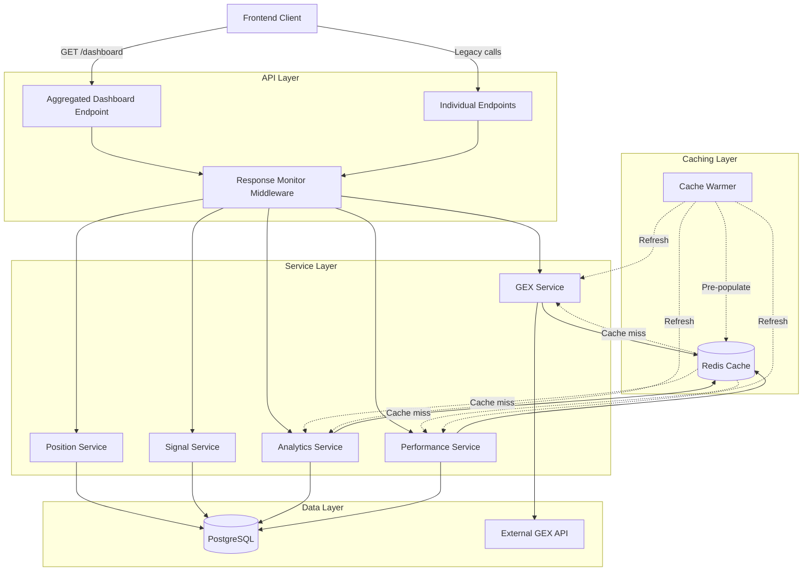

# Design Document: Dashboard Performance Optimization

## Overview

This design addresses critical performance bottlenecks in the trading platform dashboard by implementing a multi-layered caching strategy, API aggregation, and query optimization. The current 5-second load time stems from 9 sequential API calls without caching, each hitting databases or external APIs. Our solution reduces this to under 1 second through:

1. **Redis caching layer** for expensive operations (GEX, analytics, source performance)
2. **Aggregated dashboard endpoint** that parallelizes data fetching
3. **Cache warming** to pre-populate frequently accessed data
4. **Response time monitoring** for performance visibility
5. **Backward compatibility** to enable gradual migration

The design maintains real-time data freshness for critical trading data (positions, exit signals) while aggressively caching stable data (analytics, market data).

## Architecture

### High-Level Architecture



### Caching Strategy

**Cache Tiers:**
1. **No Cache (Real-time)**: Positions, shadow positions, exit signals, queued signals, health
2. **Short TTL (5 min)**: GEX data (external API, market data changes frequently)
3. **Medium TTL (10 min)**: Source performance (aggregated metrics, moderate volatility)
4. **Long TTL (15 min)**: Analytics (PnL curves, daily returns, historical data)

**Cache Key Patterns:**
- GEX: `gex:{symbol}:{date}`
- Analytics PnL: `analytics:pnl:{account_id}:{date_range}`
- Analytics Returns: `analytics:returns:{account_id}:{date_range}`
- Source Performance: `performance:sources:{date_range}`

### Data Flow

**Aggregated Endpoint Flow:**
1. Client calls `GET /api/dashboard`
2. Response Monitor records start time
3. Dashboard controller initiates parallel fetches:
   - Real-time data: Direct DB queries (positions, signals, health)
   - Cached data: Check Redis first (GEX, analytics, performance)
4. Cache misses trigger service-level fetches
5. Results aggregated into single response
6. Response Monitor logs completion time and cache metrics
7. Client receives complete dashboard data

**Cache Warming Flow:**
1. System startup: Cache Warmer initializes
2. Warmer fetches critical data (SPY GEX, default analytics)
3. Background scheduler monitors TTLs
4. Before expiration: Warmer refreshes proactively
5. Market hours: Prioritize trading-critical data
6. Failures: Log and retry with exponential backoff

## Components and Interfaces

### 1. Aggregated Dashboard Endpoint

**Responsibility:** Provide single endpoint for all dashboard data with parallel fetching.

**Interface:**
```typescript
// GET /api/dashboard
interface DashboardRequest {
  // Optional filters
  account_id?: string;
  date_range?: { start: string; end: string };
}

interface DashboardResponse {
  positions: Position[];
  shadow_positions: ShadowPosition[];
  health: HealthStatus;
  exit_signals: ExitSignal[];
  queued_signals: Signal[];
  source_performance: SourcePerformance[];
  gex: GEXData;
  pnl_curve: PnLCurveData;
  daily_returns: DailyReturnsData;
  metadata: {
    response_time_ms: number;
    cache_hits: string[];
    cache_misses: string[];
    timestamp: string;
  };
  errors?: {
    [key: string]: string; // Partial failures
  };
}
```

**Key Methods:**
- `fetchDashboardData(request: DashboardRequest): Promise<DashboardResponse>`
- `fetchRealTimeData(): Promise<RealTimeData>`
- `fetchCachedData(): Promise<CachedData>`
- `aggregateResults(realTime, cached): DashboardResponse`

### 2. Redis Cache Manager

**Responsibility:** Manage cache operations with TTL-based expiration and key patterns.

**Interface:**
```typescript
interface CacheManager {
  get<T>(key: string): Promise<T | null>;
  set<T>(key: string, value: T, ttl: number): Promise<void>;
  invalidate(pattern: string): Promise<void>;
  exists(key: string): Promise<boolean>;
  getTTL(key: string): Promise<number>;
}

interface CacheConfig {
  host: string;
  port: number;
  ttl: {
    gex: number;        // 300 seconds (5 min)
    analytics: number;  // 900 seconds (15 min)
    performance: number; // 600 seconds (10 min)
  };
}
```

**Key Methods:**
- `getCached<T>(key: string): Promise<CachedResult<T>>`
- `setCached<T>(key: string, value: T, ttl: number): Promise<void>`
- `invalidatePattern(pattern: string): Promise<number>`
- `buildKey(type: string, params: object): string`

### 3. GEX Service with Caching

**Responsibility:** Fetch GEX data from external API with Redis caching layer.

**Interface:**
```typescript
interface GEXService {
  getGEX(symbol: string): Promise<GEXData>;
  refreshGEX(symbol: string): Promise<GEXData>;
}

interface GEXData {
  symbol: string;
  gamma_exposure: number;
  call_wall: number;
  put_wall: number;
  timestamp: string;
  cached: boolean;
  cache_age_seconds?: number;
}
```

**Key Methods:**
- `getGEXData(symbol: string): Promise<GEXData>`
- `fetchFromExternalAPI(symbol: string): Promise<GEXData>`
- `getCacheKey(symbol: string): string`
- `handleExternalAPIFailure(symbol: string): Promise<GEXData>`

### 4. Analytics Service with Caching

**Responsibility:** Calculate PnL curves and daily returns with caching and optimized queries.

**Interface:**
```typescript
interface AnalyticsService {
  getPnLCurve(accountId: string, dateRange: DateRange): Promise<PnLCurveData>;
  getDailyReturns(accountId: string, dateRange: DateRange): Promise<DailyReturnsData>;
  invalidateAnalytics(accountId: string): Promise<void>;
}

interface PnLCurveData {
  data_points: Array<{ date: string; pnl: number }>;
  total_pnl: number;
  cached: boolean;
}

interface DailyReturnsData {
  returns: Array<{ date: string; return_pct: number }>;
  avg_return: number;
  cached: boolean;
}
```

**Key Methods:**
- `calculatePnLCurve(accountId: string, range: DateRange): Promise<PnLCurveData>`
- `calculateDailyReturns(accountId: string, range: DateRange): Promise<DailyReturnsData>`
- `getCachedAnalytics<T>(key: string): Promise<T | null>`
- `executeOptimizedQuery(query: string): Promise<any[]>`

### 5. Cache Warmer

**Responsibility:** Pre-populate and refresh cache entries proactively.

**Interface:**
```typescript
interface CacheWarmer {
  start(): Promise<void>;
  stop(): Promise<void>;
  warmCriticalData(): Promise<void>;
  scheduleRefresh(key: string, ttl: number): void;
}

interface WarmingConfig {
  enabled: boolean;
  critical_symbols: string[]; // e.g., ['SPY', 'QQQ']
  refresh_threshold: number;  // Refresh when TTL < threshold
  retry_config: {
    max_retries: number;
    backoff_ms: number;
  };
}
```

**Key Methods:**
- `warmGEXData(symbols: string[]): Promise<void>`
- `warmAnalytics(): Promise<void>`
- `warmSourcePerformance(): Promise<void>`
- `scheduleProactiveRefresh(key: string, ttl: number): void`
- `handleWarmingFailure(error: Error, key: string): Promise<void>`

### 6. Response Monitor Middleware

**Responsibility:** Track and log API response times with cache metrics.

**Interface:**
```typescript
interface ResponseMonitor {
  recordStart(requestId: string): void;
  recordEnd(requestId: string, metadata: ResponseMetadata): void;
  getMetrics(): PerformanceMetrics;
}

interface ResponseMetadata {
  endpoint: string;
  status_code: number;
  cache_hits: string[];
  cache_misses: string[];
  response_time_ms: number;
}

interface PerformanceMetrics {
  avg_response_time: number;
  p95_response_time: number;
  p99_response_time: number;
  cache_hit_rate: number;
  slow_requests: number; // > 1 second
}
```

**Key Methods:**
- `middleware(req, res, next): void`
- `calculateResponseTime(startTime: number): number`
- `logSlowRequest(metadata: ResponseMetadata): void`
- `exportMetrics(): PerformanceMetrics`

### 7. Position Service (Real-time)

**Responsibility:** Fetch current positions without caching.

**Interface:**
```typescript
interface PositionService {
  getOpenPositions(): Promise<Position[]>;
  getShadowPositions(): Promise<ShadowPosition[]>;
}

interface Position {
  id: string;
  symbol: string;
  quantity: number;
  entry_price: number;
  current_price: number;
  pnl: number;
  status: 'open' | 'closed';
}
```

### 8. Signal Service (Real-time)

**Responsibility:** Fetch current signals and exit signals without caching.

**Interface:**
```typescript
interface SignalService {
  getActiveExitSignals(): Promise<ExitSignal[]>;
  getQueuedSignals(): Promise<Signal[]>;
  getSourcePerformance(): Promise<SourcePerformance[]>; // Cached
}

interface ExitSignal {
  id: string;
  position_id: string;
  signal_type: string;
  timestamp: string;
  status: 'active' | 'executed';
}
```

## Data Models

### Cache Entry Model

```typescript
interface CacheEntry<T> {
  key: string;
  value: T;
  ttl: number;
  created_at: number;
  expires_at: number;
}

interface CachedResult<T> {
  data: T | null;
  hit: boolean;
  age_seconds?: number;
  ttl_remaining?: number;
}
```

### Dashboard Data Model

```typescript
interface DashboardData {
  // Real-time data (no cache)
  positions: Position[];
  shadow_positions: ShadowPosition[];
  health: HealthStatus;
  exit_signals: ExitSignal[];
  queued_signals: Signal[];
  
  // Cached data
  source_performance: SourcePerformance[];
  gex: GEXData;
  pnl_curve: PnLCurveData;
  daily_returns: DailyReturnsData;
  
  // Metadata
  metadata: ResponseMetadata;
  errors?: Record<string, string>;
}
```

### Performance Metrics Model

```typescript
interface PerformanceMetrics {
  endpoint: string;
  timestamp: string;
  response_time_ms: number;
  cache_hit_rate: number;
  cache_hits: string[];
  cache_misses: string[];
  database_query_time_ms?: number;
  external_api_time_ms?: number;
}
```

### Cache Invalidation Event Model

```typescript
interface CacheInvalidationEvent {
  event_type: 'position_update' | 'signal_update' | 'manual_clear';
  affected_keys: string[];
  timestamp: string;
  triggered_by: string;
}
```

## Correctness Properties


*A property is a characteristic or behavior that should hold true across all valid executions of a system—essentially, a formal statement about what the system should do. Properties serve as the bridge between human-readable specifications and machine-verifiable correctness guarantees.*

### Property 1: Cache Storage with TTL

*For any* expensive query result, when stored in cache, the result should be retrievable before TTL expiration and should include the correct TTL value based on data type (GEX: 5 min, analytics: 15 min, performance: 10 min).

**Validates: Requirements 1.2, 1.5**

### Property 2: Cache Hit Returns Cached Data

*For any* cached data that has not expired, requesting that data should return the cached value without hitting the underlying data source (database or external API).

**Validates: Requirements 1.3, 3.2, 4.2**

### Property 3: Cache Miss Triggers Fresh Fetch

*For any* cache key that is expired or missing, requesting that data should trigger a fresh fetch from the underlying source and update the cache with the new value.

**Validates: Requirements 1.4, 3.3**

### Property 4: Parallel Data Fetching

*For any* aggregated dashboard request, all data fetches should execute in parallel (not sequentially), resulting in total execution time approximately equal to the slowest individual fetch, not the sum of all fetches.

**Validates: Requirements 2.1**

### Property 5: Cache Utilization in Aggregated Endpoint

*For any* aggregated dashboard request where cacheable data exists in Redis, the endpoint should use cached data and mark it as a cache hit in the response metadata.

**Validates: Requirements 2.2**

### Property 6: Complete Dashboard Response

*For any* aggregated dashboard request, the response should contain all 9 required data sections: positions, shadow_positions, health, exit_signals, queued_signals, source_performance, gex, pnl_curve, and daily_returns.

**Validates: Requirements 2.3**

### Property 7: Partial Failure Resilience

*For any* aggregated dashboard request where one or more individual data fetches fail, the response should include error information for failed sections while still returning successfully fetched data for other sections.

**Validates: Requirements 2.4**

### Property 8: Cached Response Performance

*For any* aggregated dashboard request where all cacheable data is in cache, the total response time should be under 1 second.

**Validates: Requirements 2.5**

### Property 9: GEX External API Fallback

*For any* GEX data request where the external API fails, if stale cached data exists, the service should return the cached data with a staleness indicator rather than failing the request.

**Validates: Requirements 3.4**

### Property 10: Cache Metadata Inclusion

*For any* cached data response (GEX, analytics, performance), the response should include cache metadata fields: timestamp, TTL remaining, and cache hit/miss status.

**Validates: Requirements 3.5**

### Property 11: Real-Time Data Freshness

*For any* real-time data type (positions, shadow_positions, exit_signals, queued_signals, health), fetching should always query the database directly and return the most current data without using cache.

**Validates: Requirements 6.1, 6.2, 6.3, 6.4, 6.5**

### Property 12: Cache Warmer Non-Blocking

*For any* cache warming operation, concurrent user requests should not be blocked or delayed by the warming process.

**Validates: Requirements 5.4**

### Property 13: Cache Warming Retry with Backoff

*For any* cache warming operation that fails, the system should retry with exponentially increasing delays (e.g., 1s, 2s, 4s, 8s) up to a maximum number of retries.

**Validates: Requirements 5.5**

### Property 14: Response Time Monitoring

*For any* API endpoint call, the Response Monitor should record start time, calculate response time on completion, and log the metrics including cache hit/miss information.

**Validates: Requirements 7.1, 7.2, 7.4**

### Property 15: Slow Request Alerting

*For any* API request that takes longer than 1 second, the Response Monitor should log a warning with endpoint details, response time, and cache metrics.

**Validates: Requirements 7.3**

### Property 16: Metrics Export

*For any* monitoring data collected, the Response Monitor should expose metrics (avg response time, p95, p99, cache hit rate, slow request count) in a format consumable by external monitoring tools.

**Validates: Requirements 7.5**

### Property 17: Backward Compatible Response Format

*For any* existing individual endpoint, adding caching should not change the response structure or field names, ensuring clients continue to work without modification.

**Validates: Requirements 8.1, 8.2, 8.4**

### Property 18: Cache Invalidation on Data Changes

*For any* data update that affects cached values (position updates affecting analytics, signal updates affecting source performance), the system should invalidate the related cache entries.

**Validates: Requirements 9.1, 9.2**

### Property 19: Targeted Cache Invalidation

*For any* cache invalidation operation, only the specific keys matching the invalidation pattern should be removed, leaving unrelated cached data intact.

**Validates: Requirements 9.3**

### Property 20: Cache Invalidation Fallback

*For any* cache invalidation operation that fails, the system should log the error and rely on TTL-based expiration to eventually clear stale data.

**Validates: Requirements 9.5**

### Property 21: Slow Query Logging

*For any* database query that takes longer than a configured threshold (e.g., 500ms), the system should log the query details for performance analysis.

**Validates: Requirements 10.4**

### Property 22: Indexed Query Performance

*For any* database query using proper indexes (on timestamp, status, symbol columns), the query should complete in under 500ms under normal load.

**Validates: Requirements 10.5**

## Error Handling

### Cache Connection Failures

**Scenario:** Redis connection is lost or unavailable.

**Handling:**
1. Log error with connection details
2. Fall back to direct database/API calls (degraded mode)
3. Attempt reconnection with exponential backoff
4. Alert operations team if connection fails for > 5 minutes
5. Continue serving requests without caching

**Recovery:**
- Automatic reconnection on Redis availability
- Cache warming triggered after reconnection
- Gradual return to normal performance

### External API Failures (GEX)

**Scenario:** External GEX API is down or timing out.

**Handling:**
1. Check for stale cached data
2. If stale data exists: Return with staleness indicator
3. If no cached data: Return error in GEX section of response
4. Log external API failure with timestamp
5. Continue returning other dashboard data

**Recovery:**
- Retry external API on next request
- Cache warming will refresh when API recovers
- Monitor external API health

### Database Query Timeouts

**Scenario:** Database queries exceed timeout threshold.

**Handling:**
1. Cancel long-running query
2. Log slow query details for optimization
3. Return partial dashboard data with error for timed-out section
4. Alert if multiple queries timeout
5. Consider increasing cache TTLs temporarily

**Recovery:**
- Investigate slow queries
- Add missing indexes
- Optimize query plans
- Consider read replicas for analytics

### Partial Data Fetch Failures

**Scenario:** One or more dashboard data sections fail to fetch.

**Handling:**
1. Continue fetching other sections in parallel
2. Include error details in response for failed sections
3. Return HTTP 200 with partial data (not 500)
4. Log which sections failed and why
5. Client can decide how to handle partial data

**Recovery:**
- Client can retry failed sections individually
- Cache warming will attempt to refresh failed data
- Monitor failure rates per section

### Cache Warming Failures

**Scenario:** Cache warming fails to pre-populate data.

**Handling:**
1. Log warming failure with error details
2. Retry with exponential backoff (1s, 2s, 4s, 8s)
3. Skip warming for that data type after max retries
4. First user request will populate cache (cold start)
5. Don't block system startup on warming failures

**Recovery:**
- Scheduled warming will retry on next cycle
- User requests will populate cache organically
- Monitor warming success rate

### Memory Pressure (Redis)

**Scenario:** Redis memory usage approaches limits.

**Handling:**
1. Redis eviction policy: LRU (Least Recently Used)
2. Monitor memory usage metrics
3. Alert when usage > 80%
4. Consider reducing TTLs temporarily
5. Prioritize critical data (GEX, analytics)

**Recovery:**
- Increase Redis memory allocation
- Optimize cache key sizes
- Review TTL configurations
- Consider cache partitioning

## Testing Strategy

### Dual Testing Approach

This feature requires both **unit tests** and **property-based tests** for comprehensive coverage:

- **Unit tests**: Verify specific examples, edge cases, error conditions, and integration points
- **Property tests**: Verify universal properties across all inputs through randomization

### Unit Testing Focus

Unit tests should cover:

1. **Specific Examples:**
   - System startup with Redis connection (Req 1.1)
   - Cache warming on startup (Req 5.1)
   - Admin endpoint for manual cache clearing (Req 9.4)
   - Both aggregated and individual endpoints available (Req 8.3)

2. **Edge Cases:**
   - Empty cache scenarios
   - Redis connection failures
   - External API timeouts
   - Database query failures
   - Concurrent cache warming and user requests

3. **Error Conditions:**
   - Invalid cache keys
   - Malformed responses from external APIs
   - Database connection errors
   - Cache invalidation failures

4. **Integration Points:**
   - Redis client integration
   - External GEX API integration
   - Database connection pooling
   - Middleware chain execution

### Property-Based Testing Configuration

**Library Selection:**
- **TypeScript/JavaScript**: fast-check
- **Python**: Hypothesis
- **Java**: jqwik
- **Go**: gopter

**Test Configuration:**
- Minimum 100 iterations per property test
- Each test tagged with: `Feature: dashboard-performance-optimization, Property {N}: {property_text}`
- Generators for: cache keys, TTL values, dashboard requests, timestamps, data payloads

**Property Test Coverage:**

Each correctness property (1-22) should be implemented as a single property-based test:

1. **Property 1 (Cache Storage)**: Generate random query results and TTL types, verify storage and retrieval
2. **Property 2 (Cache Hits)**: Generate random cached data, verify retrieval without source access
3. **Property 3 (Cache Misses)**: Generate expired/missing keys, verify fresh fetch and cache update
4. **Property 4 (Parallel Fetching)**: Generate dashboard requests, verify parallel execution timing
5. **Property 5 (Cache Utilization)**: Generate requests with pre-cached data, verify cache usage
6. **Property 6 (Complete Response)**: Generate dashboard requests, verify all 9 sections present
7. **Property 7 (Partial Failures)**: Generate requests with simulated failures, verify partial data return
8. **Property 8 (Performance)**: Generate cached requests, verify < 1 second response time
9. **Property 9 (GEX Fallback)**: Generate GEX requests with API failures, verify stale data return
10. **Property 10 (Cache Metadata)**: Generate cached requests, verify metadata fields present
11. **Property 11 (Real-Time Freshness)**: Generate real-time data requests, verify no caching
12. **Property 12 (Non-Blocking Warming)**: Generate concurrent warming and user requests, verify no blocking
13. **Property 13 (Retry Backoff)**: Generate warming failures, verify exponential backoff pattern
14. **Property 14 (Response Monitoring)**: Generate API calls, verify metrics recorded
15. **Property 15 (Slow Request Alerts)**: Generate slow requests, verify warnings logged
16. **Property 16 (Metrics Export)**: Generate monitoring data, verify export format
17. **Property 17 (Backward Compatibility)**: Generate requests to old endpoints, verify response format unchanged
18. **Property 18 (Invalidation on Changes)**: Generate data updates, verify cache invalidation
19. **Property 19 (Targeted Invalidation)**: Generate invalidation patterns, verify only matching keys removed
20. **Property 20 (Invalidation Fallback)**: Generate invalidation failures, verify TTL fallback
21. **Property 21 (Slow Query Logging)**: Generate slow queries, verify logging
22. **Property 22 (Indexed Performance)**: Generate indexed queries, verify < 500ms completion

### Test Data Generators

**For Property-Based Tests:**

```typescript
// Example generators for fast-check (TypeScript)

// Cache key generator
const cacheKeyGen = fc.record({
  type: fc.constantFrom('gex', 'analytics', 'performance'),
  params: fc.dictionary(fc.string(), fc.string())
});

// TTL generator based on type
const ttlGen = (type: string) => {
  const ttls = { gex: 300, analytics: 900, performance: 600 };
  return fc.constant(ttls[type]);
};

// Dashboard request generator
const dashboardRequestGen = fc.record({
  account_id: fc.option(fc.uuid()),
  date_range: fc.option(fc.record({
    start: fc.date(),
    end: fc.date()
  }))
});

// Cached data generator
const cachedDataGen = fc.record({
  value: fc.anything(),
  ttl: fc.integer({ min: 0, max: 900 }),
  created_at: fc.date()
});
```

### Performance Testing

**Load Testing:**
- Simulate 100 concurrent users
- Measure response times under load
- Verify cache hit rates > 80%
- Ensure < 1 second p95 response time

**Stress Testing:**
- Test with Redis unavailable
- Test with external API failures
- Test with database slow queries
- Verify graceful degradation

**Benchmark Testing:**
- Baseline: Current 5-second load time
- Target: < 1 second with caching
- Measure improvement per optimization
- Track cache hit rates over time

### Integration Testing

**End-to-End Scenarios:**
1. Fresh system startup → cache warming → first request
2. Cached data → user request → cache hit
3. Expired cache → user request → cache miss → refresh
4. Data update → cache invalidation → fresh fetch
5. External API failure → stale data fallback
6. Redis failure → degraded mode → recovery

**Monitoring Validation:**
- Verify metrics exported correctly
- Verify slow request alerts triggered
- Verify cache hit/miss tracking
- Verify performance dashboards updated
