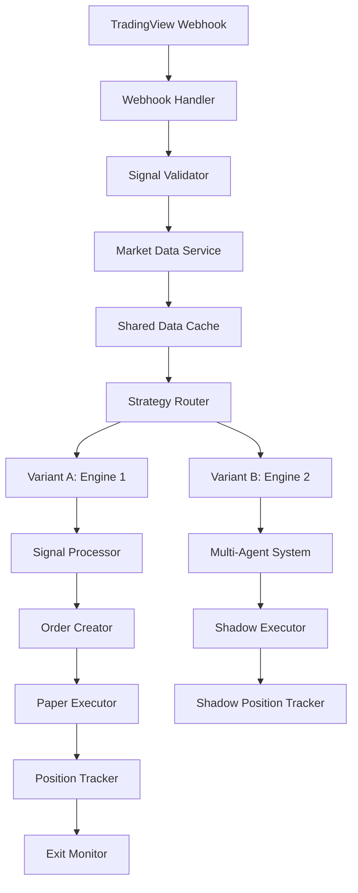

can you # Design Document: Dual-Engine Options Trading Platform

## Overview

This design specifies a production-ready options trading platform with two parallel decision engines. The architecture prioritizes non-breaking integration, shared resource optimization, and safe experimentation through feature flags and shadow execution.

### System Architecture

The platform consists of two independent but coordinated engines:

**Engine 1 (Control/Production)**: Traditional signal processing pipeline
- Receives TradingView webhooks
- Validates and enriches signals with market data
- Creates and executes paper trades
- Tracks positions with real-time P&L
- Monitors exit conditions

**Engine 2 (Experimental/Shadow)**: Multi-agent swarm decision system
- Runs in parallel via A/B testing framework
- Uses specialized agents for collaborative decision-making
- Shares market data enrichment with Engine 1 (no duplicate API calls)
- Executes in shadow mode (logs decisions, no live trades)
- Fully feature-flagged and reversible

### Key Design Principles

1. **Non-Breaking Integration**: Engine 2 additions must not modify Engine 1 logic
2. **Shared Data Layer**: Single market data enrichment pass for both engines
3. **Shadow Execution**: Engine 2 never places live trades
4. **Feature Flags**: All Engine 2 functionality behind runtime toggles
5. **Event Sourcing**: Complete audit trail for replay and analysis
6. **Graceful Degradation**: System continues operating when components fail


## Architecture

### High-Level Flow



### Technology Stack

- **Backend**: Node.js 20+ with Express
- **Database**: PostgreSQL (Neon hosted)
- **Cache**: In-memory cache with TTL (node-cache or similar)
- **Frontend**: React 18 + TypeScript + Vite + shadcn/ui
- **Deployment**: Fly.io
- **Market Data**: Alpaca (primary), TwelveData (backup)
- **Authentication**: JWT tokens

### Component Architecture

#### Core Services Layer
- **Database Service**: PostgreSQL connection pool, query execution
- **Cache Service**: In-memory caching with TTL and eviction
- **Rate Limiter Service**: Token bucket algorithm for API throttling
- **Market Data Service**: Unified interface for market data providers
- **Authentication Service**: JWT generation and validation

#### Engine 1 Components
- **Webhook Handler**: Receives and validates TradingView signals
- **Signal Processor**: Enriches signals and applies risk checks
- **Order Creator**: Calculates strikes, expiration, position sizing
- **Paper Executor**: Simulates order fills with real prices
- **Position Tracker**: Updates P&L and monitors positions
- **Exit Monitor**: Checks exit conditions and creates exit orders

#### Engine 2 Components
- **Strategy Router**: A/B test routing with deterministic hashing
- **Agent Framework**: Base classes and interfaces for agents
- **Core Agents**: Technical, Context, Risk, Meta-Decision
- **Specialist Agents**: ORB, Strat, TTM (conditionally activated)
- **Sub-Agents**: Satyland (support only, no execution authority)
- **Shadow Executor**: Simulates trades without live execution
- **Event Logger**: Append-only logging for replay

#### Background Workers
- **Signal Processor Worker**: Runs every 30 seconds
- **Order Creator Worker**: Runs every 30 seconds
- **Paper Executor Worker**: Runs every 10 seconds
- **Position Refresher Worker**: Runs every 60 seconds
- **Exit Monitor Worker**: Runs every 60 seconds


## Components and Interfaces

### Market Data Service

**Purpose**: Fetch and cache market data from external providers, derive technical indicators

**Interface**:
```typescript
interface MarketDataService {
  // Fetch OHLCV candles with automatic caching
  getCandles(symbol: string, timeframe: string, limit: number): Promise<Candle[]>
  
  // Get derived indicators (uses cached candles)
  getIndicators(symbol: string, timeframe: string): Promise<Indicators>
  
  // Get current option price
  getOptionPrice(symbol: string, strike: number, expiration: Date, type: 'call' | 'put'): Promise<number>
  
  // Get cache statistics
  getCacheStats(): CacheStats
}

interface Candle {
  timestamp: Date
  open: number
  high: number
  low: number
  close: number
  volume: number
}

interface Indicators {
  ema8: number[]
  ema13: number[]
  ema21: number[]
  ema48: number[]
  ema200: number[]
  atr: number[]
  bollingerBands: { upper: number[], middle: number[], lower: number[] }
  keltnerChannels: { upper: number[], middle: number[], lower: number[] }
  ttmSqueeze: { state: 'on' | 'off', momentum: number }
}
```

**Implementation Details**:
- Primary provider: Alpaca API
- Fallback provider: TwelveData API
- Cache TTL: 60 seconds
- Cache key format: `{provider}:{symbol}:{timeframe}:{limit}`
- Indicator derivation: Compute from cached OHLCV data (no additional API calls)
- Rate limiting: 200 req/min for Alpaca, 800 req/day for TwelveData


### Strategy Router (A/B Testing)

**Purpose**: Deterministically route signals to Engine 1 or Engine 2 based on experiment configuration

**Interface**:
```typescript
interface StrategyRouter {
  // Route signal to variant and create experiment record
  route(signal: Signal): Promise<RoutingDecision>
  
  // Get experiment results
  getExperimentResults(experimentId: string): Promise<ExperimentResults>
}

interface RoutingDecision {
  experimentId: string
  variant: 'A' | 'B'
  assignmentReason: string
}

interface ExperimentResults {
  experimentId: string
  variantA: VariantMetrics
  variantB: VariantMetrics
  statisticalSignificance: number
}
```

**Implementation Details**:
- Hash function: `hash = SHA256(symbol + timeframe + sessionId) % 100`
- Variant assignment: `variant = hash < splitPercentage ? 'B' : 'A'`
- Default split: 0% to Variant B (all traffic to Engine 1)
- Feature flag check: If `enable_variant_b` is false, always return Variant A
- Experiment record: Store in `experiments` table with timestamp and metadata


### Agent Framework (Engine 2)

**Purpose**: Provide base classes and interfaces for all agent types

**Interface**:
```typescript
interface Agent {
  name: string
  type: 'core' | 'specialist' | 'subagent'
  
  // Analyze signal and return decision
  analyze(signal: EnrichedSignal, marketData: MarketData): Promise<AgentOutput>
  
  // Check if agent should be activated for this signal
  shouldActivate(signal: EnrichedSignal, marketData: MarketData): boolean
}

interface AgentOutput {
  agent: string
  bias: 'bullish' | 'bearish' | 'neutral'
  confidence: number  // 0-100
  reasons: string[]
  block: boolean
  metadata?: Record<string, any>  // Agent-specific attribution
}

interface EnrichedSignal {
  signalId: string
  symbol: string
  direction: 'long' | 'short'
  timeframe: string
  timestamp: Date
  sessionType: 'RTH' | 'ETH'
}

interface MarketData {
  candles: Candle[]
  indicators: Indicators
  currentPrice: number
  sessionContext: SessionContext
}
```

**Agent Types**:

1. **Core Agents** (always active):
   - Technical Agent: Price action, indicators, patterns
   - Context Agent: Market regime, volatility, trend
   - Risk Agent: Position limits, exposure, absolute veto
   - Meta-Decision Agent: Aggregates all outputs

2. **Specialist Agents** (conditionally active):
   - ORB Specialist: Opening Range Breakout analysis
   - Strat Specialist: The Strat methodology patterns
   - TTM Specialist: TTM Squeeze indicator analysis

3. **Sub-Agents** (support only):
   - Satyland Sub-Agent: Confirmation using Satyland strategies


### Core Agents Implementation

#### Technical Agent
**Activation**: Always active for Variant B signals
**Analysis**:
- Price position relative to EMAs (8, 13, 21, 48, 200)
- Trend direction (EMA alignment)
- Support/resistance levels
- Candlestick patterns

**Confidence Calculation**:
- Strong trend alignment: 70-90
- Moderate alignment: 40-70
- Weak/conflicting signals: 0-40

#### Context Agent
**Activation**: Always active for Variant B signals
**Analysis**:
- Market regime (trending, ranging, volatile)
- Volatility state (ATR percentile)
- Session context (opening, mid-day, closing)
- Broader market conditions (SPY/QQQ if analyzing individual stocks)

**Confidence Calculation**:
- Favorable regime + low volatility: 70-90
- Neutral regime: 40-70
- Unfavorable regime + high volatility: 0-40

#### Risk Agent
**Activation**: Always active for Variant B signals
**Analysis**:
- Position size limits
- Total exposure limits
- Correlation with existing positions
- Market hours validation
- Capital allocation rules

**Block Conditions**:
- Position limit exceeded
- Total exposure > max_exposure_percent
- Outside allowed trading hours
- Insufficient capital

**Confidence**: Not applicable (binary block/allow)

#### Meta-Decision Agent
**Activation**: Always active after all other agents complete
**Aggregation Logic**:
1. Check Risk Agent block flag (if true, reject immediately)
2. Collect all agent outputs with confidence scores
3. Apply weighting hierarchy:
   - Specialist agents: 40% weight
   - Core agents: 35% weight
   - Sub-agents: 25% weight
4. Calculate weighted average confidence
5. Determine consensus bias (majority vote with confidence weighting)
6. Produce final decision with attribution

**Output**:
```typescript
interface MetaDecision {
  finalBias: 'bullish' | 'bearish' | 'neutral'
  finalConfidence: number
  contributingAgents: string[]
  consensusStrength: number  // 0-100, measures agreement
  decision: 'approve' | 'reject'
  reasons: string[]
}
```


### Specialist Agents Implementation

#### ORB Specialist
**Activation Conditions**:
- Feature flag `enable_orb_specialist` is true
- Symbol is SPY, QQQ, or SPX
- Session type is RTH
- Current time is within opening window (9:30-10:00 AM ET)

**Analysis**:
- Calculate opening range (high/low of first N minutes)
- Detect breakout direction and magnitude
- Assess momentum follow-through (volume, price acceleration)
- Validate against false breakout patterns

**Confidence Calculation**:
- Strong breakout + high volume + momentum: 80-100
- Moderate breakout + average volume: 50-80
- Weak breakout or potential fakeout: 0-50

**Metadata**:
```typescript
{
  orbHigh: number
  orbLow: number
  breakoutDirection: 'up' | 'down'
  breakoutMagnitude: number  // % beyond range
  volumeRatio: number  // current volume / average volume
}
```

#### Strat Specialist
**Activation Conditions**:
- Feature flag `enable_strat_specialist` is true
- Market structure patterns detected in recent candles

**Analysis**:
- Classify candles (1: inside bar, 2: directional, 3: outside bar)
- Detect patterns:
  - 2-1-2 continuation
  - 3-1-2 continuation
  - 3-2-2 reversal
  - HTF rejection
  - Wick-based rejection
- Check HTF/LTF alignment
- Validate with TTM Squeeze if available

**Confidence Calculation**:
- Strong pattern + HTF alignment + TTM confirmation: 75-95
- Moderate pattern + partial alignment: 40-75
- Weak pattern or conflicting signals: 15-40

**Metadata**:
```typescript
{
  stratPattern: '2-1-2' | '3-1-2' | '3-2-2' | 'htf-rejection' | 'wick-rejection'
  candleSequence: number[]  // e.g., [2, 1, 2]
  htfAlignment: boolean
  ltfAlignment: boolean
  ttmConfirmation: boolean
}
```

#### TTM Specialist
**Activation Conditions**:
- Feature flag `enable_ttm_specialist` is true
- TTM Squeeze state is 'OFF' (expansion phase)
- Momentum histogram is aligned with signal direction

**Analysis**:
- Detect squeeze release (transition from ON to OFF)
- Measure momentum strength and direction
- Validate release quality (clean vs choppy)
- Check alignment with price structure

**Confidence Calculation**:
- Clean release + strong momentum + structure alignment: 60-80
- Moderate release + average momentum: 30-60
- Weak release or conflicting signals: 0-30

**Metadata**:
```typescript
{
  squeezeState: 'on' | 'off'
  momentumDirection: 'bullish' | 'bearish'
  momentumStrength: number
  releaseQuality: 'clean' | 'choppy'
  barsInExpansion: number
}
```


### Sub-Agents Implementation

#### Satyland Sub-Agent
**Activation Conditions**:
- Feature flag `enable_satyland_subagent` is true
- Signal is being analyzed by Engine 2

**Analysis Components**:
1. **Pivot Ribbon**: EMA alignment (8, 13, 21, 48, 200)
   - Bullish: Price above ribbon, EMAs in ascending order
   - Bearish: Price below ribbon, EMAs in descending order

2. **ATR Levels**: Support/resistance based on ATR multiples
   - Check if price is at significant ATR level
   - Validate level-to-level progression

3. **Phase Oscillator**: Trend strength indicator
   - Positive and rising: Strong bullish trend
   - Negative and falling: Strong bearish trend

4. **Volume Stack Proxy**: Relative volume analysis
   - High volume on breakout: Confirmation
   - Low volume on breakout: Caution

**Confidence Calculation**:
- All components aligned + strong trend: 70-90
- Most components aligned: 40-70
- Mixed signals: 20-40

**Metadata**:
```typescript
{
  ribbonAlignment: 'bullish' | 'bearish' | 'neutral'
  atLevelToLevel: boolean
  phaseOscillator: number
  volumeQuality: 'high' | 'average' | 'low'
  pullbackQuality: 'clean' | 'choppy'
}
```

**Promotion Path**:
- Track performance over ≥300 shadow signals
- Calculate expectancy: (win_rate * avg_win) - (loss_rate * avg_loss)
- If expectancy > threshold, promote to specialist agent status


### Shadow Executor

**Purpose**: Simulate trade execution for Engine 2 without placing live orders

**Interface**:
```typescript
interface ShadowExecutor {
  // Simulate order creation and execution
  simulateExecution(decision: MetaDecision, signal: EnrichedSignal): Promise<ShadowTrade>
  
  // Update shadow positions with current prices
  refreshShadowPositions(): Promise<void>
  
  // Check exit conditions for shadow positions
  monitorShadowExits(): Promise<void>
}

interface ShadowTrade {
  shadowTradeId: string
  experimentId: string
  signalId: string
  symbol: string
  optionSymbol: string
  strike: number
  expiration: Date
  type: 'call' | 'put'
  quantity: number
  entryPrice: number
  entryTimestamp: Date
  contributingAgents: string[]
  metaConfidence: number
}
```

**Implementation Details**:
- Use same order creation logic as Engine 1 (strike selection, expiration, sizing)
- Fetch real option prices from Market Data Service
- Store in `shadow_trades` table with full attribution
- Create/update `shadow_positions` table
- Run same refresh and exit monitoring logic as Engine 1
- Never call actual order placement APIs


### Feature Flag Service

**Purpose**: Manage runtime configuration toggles for Engine 2 functionality

**Interface**:
```typescript
interface FeatureFlagService {
  // Check if feature is enabled
  isEnabled(flagName: string): boolean
  
  // Update feature flag (admin only)
  updateFlag(flagName: string, enabled: boolean): Promise<void>
  
  // Get all flags
  getAllFlags(): Promise<FeatureFlag[]>
  
  // Refresh cache from database
  refreshCache(): Promise<void>
}

interface FeatureFlag {
  name: string
  enabled: boolean
  description: string
  updatedAt: Date
  updatedBy: string
}
```

**Default Flags** (all false):
- `enable_variant_b`: Master switch for Engine 2
- `enable_orb_specialist`: ORB Specialist agent
- `enable_strat_specialist`: Strat Specialist agent
- `enable_ttm_specialist`: TTM Specialist agent
- `enable_satyland_subagent`: Satyland Sub-Agent
- `enable_shadow_execution`: Shadow trade simulation

**Implementation Details**:
- Store flags in `feature_flags` table
- Cache in memory with 5-second refresh interval
- Provide admin API endpoint for updates
- Log all flag changes with user and timestamp
- Validate flag names against whitelist


## Data Models

### Database Schema

#### Engine 1 Tables

**signals**
```sql
CREATE TABLE signals (
  signal_id UUID PRIMARY KEY DEFAULT gen_random_uuid(),
  symbol VARCHAR(20) NOT NULL,
  direction VARCHAR(10) NOT NULL,  -- 'long' | 'short'
  timeframe VARCHAR(10) NOT NULL,
  timestamp TIMESTAMPTZ NOT NULL,
  status VARCHAR(20) NOT NULL,  -- 'pending' | 'approved' | 'rejected'
  raw_payload JSONB,
  created_at TIMESTAMPTZ DEFAULT NOW(),
  INDEX idx_signals_status (status),
  INDEX idx_signals_created_at (created_at)
);
```

**refactored_signals**
```sql
CREATE TABLE refactored_signals (
  refactored_signal_id UUID PRIMARY KEY DEFAULT gen_random_uuid(),
  signal_id UUID REFERENCES signals(signal_id),
  enriched_data JSONB,  -- Market context, indicators
  risk_check_result JSONB,
  rejection_reason TEXT,
  processed_at TIMESTAMPTZ DEFAULT NOW()
);
```

**orders**
```sql
CREATE TABLE orders (
  order_id UUID PRIMARY KEY DEFAULT gen_random_uuid(),
  signal_id UUID REFERENCES signals(signal_id),
  symbol VARCHAR(20) NOT NULL,
  option_symbol VARCHAR(50) NOT NULL,
  strike DECIMAL(10, 2) NOT NULL,
  expiration DATE NOT NULL,
  type VARCHAR(10) NOT NULL,  -- 'call' | 'put'
  quantity INTEGER NOT NULL,
  order_type VARCHAR(20) NOT NULL,  -- 'paper' | 'live'
  status VARCHAR(20) NOT NULL,  -- 'pending_execution' | 'filled' | 'failed'
  created_at TIMESTAMPTZ DEFAULT NOW(),
  INDEX idx_orders_status (status),
  INDEX idx_orders_signal_id (signal_id)
);
```

**trades**
```sql
CREATE TABLE trades (
  trade_id UUID PRIMARY KEY DEFAULT gen_random_uuid(),
  order_id UUID REFERENCES orders(order_id),
  fill_price DECIMAL(10, 4) NOT NULL,
  fill_quantity INTEGER NOT NULL,
  fill_timestamp TIMESTAMPTZ NOT NULL,
  commission DECIMAL(10, 2) DEFAULT 0,
  created_at TIMESTAMPTZ DEFAULT NOW()
);
```

**refactored_positions**
```sql
CREATE TABLE refactored_positions (
  position_id UUID PRIMARY KEY DEFAULT gen_random_uuid(),
  symbol VARCHAR(20) NOT NULL,
  option_symbol VARCHAR(50) NOT NULL,
  strike DECIMAL(10, 2) NOT NULL,
  expiration DATE NOT NULL,
  type VARCHAR(10) NOT NULL,
  quantity INTEGER NOT NULL,
  entry_price DECIMAL(10, 4) NOT NULL,
  current_price DECIMAL(10, 4),
  unrealized_pnl DECIMAL(10, 2),
  realized_pnl DECIMAL(10, 2),
  status VARCHAR(20) NOT NULL,  -- 'open' | 'closing' | 'closed'
  entry_timestamp TIMESTAMPTZ NOT NULL,
  exit_timestamp TIMESTAMPTZ,
  exit_reason TEXT,
  last_updated TIMESTAMPTZ DEFAULT NOW(),
  INDEX idx_positions_status (status),
  INDEX idx_positions_symbol (symbol)
);
```

**exit_rules**
```sql
CREATE TABLE exit_rules (
  rule_id UUID PRIMARY KEY DEFAULT gen_random_uuid(),
  rule_name VARCHAR(50) NOT NULL,
  profit_target_percent DECIMAL(5, 2),
  stop_loss_percent DECIMAL(5, 2),
  max_hold_time_hours INTEGER,
  min_dte_exit INTEGER,
  enabled BOOLEAN DEFAULT true,
  created_at TIMESTAMPTZ DEFAULT NOW()
);
```

**risk_limits**
```sql
CREATE TABLE risk_limits (
  limit_id UUID PRIMARY KEY DEFAULT gen_random_uuid(),
  max_position_size INTEGER,
  max_total_exposure DECIMAL(10, 2),
  max_exposure_percent DECIMAL(5, 2),
  max_positions_per_symbol INTEGER,
  enabled BOOLEAN DEFAULT true,
  created_at TIMESTAMPTZ DEFAULT NOW()
);
```


#### Engine 2 Tables

**experiments**
```sql
CREATE TABLE experiments (
  experiment_id UUID PRIMARY KEY DEFAULT gen_random_uuid(),
  signal_id UUID REFERENCES signals(signal_id),
  variant VARCHAR(1) NOT NULL,  -- 'A' | 'B'
  assignment_hash VARCHAR(64) NOT NULL,
  split_percentage INTEGER NOT NULL,
  created_at TIMESTAMPTZ DEFAULT NOW(),
  INDEX idx_experiments_variant (variant),
  INDEX idx_experiments_signal_id (signal_id)
);
```

**agent_decisions**
```sql
CREATE TABLE agent_decisions (
  decision_id UUID PRIMARY KEY DEFAULT gen_random_uuid(),
  experiment_id UUID REFERENCES experiments(experiment_id),
  signal_id UUID REFERENCES signals(signal_id),
  agent_name VARCHAR(50) NOT NULL,
  agent_type VARCHAR(20) NOT NULL,  -- 'core' | 'specialist' | 'subagent'
  bias VARCHAR(20) NOT NULL,  -- 'bullish' | 'bearish' | 'neutral'
  confidence INTEGER NOT NULL CHECK (confidence >= 0 AND confidence <= 100),
  reasons JSONB,
  block BOOLEAN DEFAULT false,
  metadata JSONB,
  created_at TIMESTAMPTZ DEFAULT NOW(),
  INDEX idx_agent_decisions_experiment_id (experiment_id),
  INDEX idx_agent_decisions_agent_name (agent_name)
);
```

**shadow_trades**
```sql
CREATE TABLE shadow_trades (
  shadow_trade_id UUID PRIMARY KEY DEFAULT gen_random_uuid(),
  experiment_id UUID REFERENCES experiments(experiment_id),
  signal_id UUID REFERENCES signals(signal_id),
  symbol VARCHAR(20) NOT NULL,
  option_symbol VARCHAR(50) NOT NULL,
  strike DECIMAL(10, 2) NOT NULL,
  expiration DATE NOT NULL,
  type VARCHAR(10) NOT NULL,
  quantity INTEGER NOT NULL,
  entry_price DECIMAL(10, 4) NOT NULL,
  entry_timestamp TIMESTAMPTZ NOT NULL,
  contributing_agents JSONB,
  meta_confidence INTEGER,
  created_at TIMESTAMPTZ DEFAULT NOW(),
  INDEX idx_shadow_trades_experiment_id (experiment_id),
  INDEX idx_shadow_trades_symbol (symbol)
);
```

**shadow_positions**
```sql
CREATE TABLE shadow_positions (
  shadow_position_id UUID PRIMARY KEY DEFAULT gen_random_uuid(),
  shadow_trade_id UUID REFERENCES shadow_trades(shadow_trade_id),
  symbol VARCHAR(20) NOT NULL,
  option_symbol VARCHAR(50) NOT NULL,
  strike DECIMAL(10, 2) NOT NULL,
  expiration DATE NOT NULL,
  type VARCHAR(10) NOT NULL,
  quantity INTEGER NOT NULL,
  entry_price DECIMAL(10, 4) NOT NULL,
  current_price DECIMAL(10, 4),
  unrealized_pnl DECIMAL(10, 2),
  realized_pnl DECIMAL(10, 2),
  status VARCHAR(20) NOT NULL,
  entry_timestamp TIMESTAMPTZ NOT NULL,
  exit_timestamp TIMESTAMPTZ,
  exit_reason TEXT,
  last_updated TIMESTAMPTZ DEFAULT NOW(),
  INDEX idx_shadow_positions_status (status),
  INDEX idx_shadow_positions_symbol (symbol)
);
```

**agent_performance**
```sql
CREATE TABLE agent_performance (
  performance_id UUID PRIMARY KEY DEFAULT gen_random_uuid(),
  agent_name VARCHAR(50) NOT NULL,
  total_signals INTEGER DEFAULT 0,
  approved_signals INTEGER DEFAULT 0,
  rejected_signals INTEGER DEFAULT 0,
  avg_confidence DECIMAL(5, 2),
  win_rate DECIMAL(5, 2),
  avg_win DECIMAL(10, 2),
  avg_loss DECIMAL(10, 2),
  expectancy DECIMAL(10, 2),
  last_updated TIMESTAMPTZ DEFAULT NOW(),
  INDEX idx_agent_performance_agent_name (agent_name)
);
```

**feature_flags**
```sql
CREATE TABLE feature_flags (
  flag_id UUID PRIMARY KEY DEFAULT gen_random_uuid(),
  name VARCHAR(100) NOT NULL UNIQUE,
  enabled BOOLEAN DEFAULT false,
  description TEXT,
  updated_at TIMESTAMPTZ DEFAULT NOW(),
  updated_by VARCHAR(100),
  INDEX idx_feature_flags_name (name)
);
```


## Correctness Properties

*A property is a characteristic or behavior that should hold true across all valid executions of a system—essentially, a formal statement about what the system should do. Properties serve as the bridge between human-readable specifications and machine-verifiable correctness guarantees.*

### Signal Ingestion Properties

Property 1: Webhook validation consistency
*For any* webhook POST request, validating the request should produce consistent results (valid or invalid) based solely on signature and payload structure
**Validates: Requirements 1.1**

Property 2: Valid signal storage
*For any* signal containing all required fields (symbol, direction, timeframe, timestamp), storing it should result in a record in the signals table with status "pending"
**Validates: Requirements 1.2**

Property 3: Invalid signal rejection
*For any* signal missing one or more required fields, the system should reject it and return HTTP 400 with error details
**Validates: Requirements 1.3**

Property 4: Deduplication idempotence
*For any* signal, sending it multiple times within 60 seconds should result in only one record being created (subsequent requests return HTTP 200 without creating new records)
**Validates: Requirements 1.4**

Property 5: Webhook logging completeness
*For any* webhook request, the system should log timestamp, payload, and validation result
**Validates: Requirements 1.6**

### Market Data Properties

Property 6: Cache consistency
*For any* market data request, if the data exists in cache with valid TTL, the cached data should be returned without additional API calls
**Validates: Requirements 2.4**

Property 7: Indicator derivation without API calls
*For any* cached OHLCV data, deriving technical indicators (EMA, ATR, Bollinger Bands, Keltner Channels) should not trigger additional API calls
**Validates: Requirements 2.5**

Property 8: API fallback behavior
*For any* market data request, if the primary API (Alpaca) fails, the system should automatically fallback to the backup API (TwelveData)
**Validates: Requirements 2.2, 18.5**

### Signal Processing Properties

Property 9: Signal enrichment completeness
*For any* pending signal, processing it should enrich it with market context from Market_Data_Service and store the enriched data
**Validates: Requirements 3.2, 3.5**

Property 10: Risk check attribution
*For any* signal that fails risk checks, the system should update its status to "rejected" with a specific rejection reason
**Validates: Requirements 3.4**

Property 11: Approved signal order creation
*For any* approved signal without an associated order, the Order_Creator should create an order with calculated strike, expiration, and position size
**Validates: Requirements 4.1, 4.2, 4.3, 4.4**

Property 12: Order-signal referential integrity
*For any* created order, it should be linked to its source signal via signal_id foreign key
**Validates: Requirements 4.6, 15.2**

### Trade Execution Properties

Property 13: Paper execution with real prices
*For any* paper order execution, the fill_price should equal the current market price fetched from the API
**Validates: Requirements 5.3**

Property 14: Trade-to-position propagation
*For any* executed trade, a position record should be created or updated in refactored_positions table with entry price and quantity
**Validates: Requirements 5.5**

Property 15: Execution retry logic
*For any* paper order where option price is unavailable, the system should retry up to 3 times before marking the order as "failed"
**Validates: Requirements 5.6**

### Position Tracking Properties

Property 16: P&L calculation invariant
*For any* position with current price available, unrealized_pnl should equal (current_price - entry_price) * quantity * 100
**Validates: Requirements 6.3**

Property 17: P&L percentage calculation
*For any* position, position_pnl_percent should equal (unrealized_pnl / cost_basis) * 100
**Validates: Requirements 6.5**

Property 18: Exit condition triggering
*For any* open position, if unrealized_pnl_percent exceeds profit_target_percent OR falls below stop_loss_percent OR time_in_position exceeds max_hold_time_hours OR days_to_expiration falls below min_dte_exit, an exit order should be created
**Validates: Requirements 7.2, 7.3, 7.4, 7.5**

Property 19: Position status transitions
*For any* position, when an exit order is created, status should transition to "closing", and when the exit order is filled, status should transition to "closed" with realized_pnl calculated
**Validates: Requirements 7.6, 7.7**

### A/B Testing Properties

Property 20: Deterministic hash consistency
*For any* signal with given symbol, timeframe, and session_id, computing the hash multiple times should always produce the same result
**Validates: Requirements 8.1**

Property 21: Variant assignment determinism
*For any* signal, given the same hash and split percentage, variant assignment should always be the same (deterministic)
**Validates: Requirements 8.2**

Property 22: Master feature flag override
*For any* signal, when feature flag "enable_variant_b" is false, the Strategy_Router should assign it to Variant_A regardless of hash or other flag states
**Validates: Requirements 8.4, 13.6**

Property 23: Experiment metadata propagation
*For any* routed signal, the experiment_id and variant should be emitted and available for downstream tracking
**Validates: Requirements 8.6**

### Multi-Agent System Properties

Property 24: Shared data access (no duplicate API calls)
*For any* Variant_B signal, all agents should receive market data from Shared_Data_Cache without triggering additional API calls
**Validates: Requirements 9.2**

Property 25: Agent output schema compliance
*For any* agent analysis, the output should conform to the schema: agent (string), bias (bullish/bearish/neutral), confidence (0-100), reasons (array), block (boolean)
**Validates: Requirements 9.4**

Property 26: Risk Agent absolute veto
*For any* signal where Risk_Agent sets block flag to true, the Meta_Decision_Agent should reject the signal regardless of other agent outputs
**Validates: Requirements 9.5**

Property 27: Specialist agent conditional activation
*For any* Variant_B signal, specialist agents (ORB, Strat, TTM) should only activate when their respective feature flags are true AND their activation conditions are met
**Validates: Requirements 10.1, 10.2, 10.3**

Property 28: Confidence bounds enforcement
*For any* agent output, confidence should be within the specified bounds: ORB (0-100), Strat (15-95), TTM (0-80), Satyland (20-90), Technical (0-90), Context (0-90)
**Validates: Requirements 10.4, 10.5, 10.6, 11.3**

Property 29: Sub-agent no veto power
*For any* signal, Satyland_SubAgent output should never have block flag set to true (sub-agents cannot veto)
**Validates: Requirements 11.4**

Property 30: Meta-decision weighting hierarchy
*For any* set of agent outputs, Meta_Decision_Agent should apply weighting: specialist agents (40%), core agents (35%), sub-agents (25%)
**Validates: Requirements 11.5**

### Shadow Execution Properties

Property 31: No live orders from Engine 2 (CRITICAL)
*For any* Variant_B signal with any Meta_Decision_Agent output, the system should never create records in the orders table with type "live" or execute live trades
**Validates: Requirements 12.1**

Property 32: Shadow execution logic parity
*For any* shadow trade simulation, the order creation logic (strike selection, expiration, position sizing) should match Engine_1 logic exactly
**Validates: Requirements 12.2**

Property 33: Shadow trade real pricing
*For any* shadow trade execution, the simulated fill_price should be fetched from real market prices via Market_Data_Service
**Validates: Requirements 12.3**

Property 34: Shadow position P&L calculation parity
*For any* shadow position, P&L calculations should use the same formulas as Engine_1 positions
**Validates: Requirements 12.6**

### Event Sourcing Properties

Property 35: Log immutability
*For any* logged event, the system should store it in append-only format without updates or deletions
**Validates: Requirements 14.5**

Property 36: Signal processing replay
*For any* logged signal processing event, loading the logged data and re-executing agent logic should produce equivalent results (replay capability)
**Validates: Requirements 14.6**

Property 37: Event logging completeness
*For any* Engine_2 signal processing, the system should log experiment_id, variant, shared_data_reference, all agent outputs, final decision, and all timestamps
**Validates: Requirements 14.1, 14.2, 14.3, 14.4**

### Error Handling Properties

Property 38: API retry with exponential backoff
*For any* failed external API call, the system should retry up to 3 times with exponential backoff before giving up
**Validates: Requirements 18.1**

Property 39: Graceful degradation
*For any* component failure, the system should log the error and continue processing other signals (no cascading failures)
**Validates: Requirements 18.2**

Property 40: Worker resilience
*For any* worker encountering an unhandled exception, the system should log the error with stack trace and restart the worker
**Validates: Requirements 18.3**

Property 41: Circuit breaker state transitions
*For any* external API, after 5 consecutive failures, the circuit breaker should open, and after 60 seconds, transition to half-open for retry
**Validates: Requirements 18.6**

### Authentication Properties

Property 42: JWT token issuance
*For any* valid login credentials, the system should issue a JWT token with 24-hour expiration
**Validates: Requirements 20.2**

Property 43: Token-based authentication
*For any* protected API endpoint (excluding webhooks and health checks), requests without valid JWT tokens should return HTTP 401 Unauthorized
**Validates: Requirements 20.1, 20.6**

Property 44: Role-based authorization
*For any* request to restricted endpoints (POST /feature-flags, shadow trading data), the system should verify user role and deny access if insufficient permissions
**Validates: Requirements 20.4, 20.5**

### Rate Limiting Properties

Property 45: API rate limit enforcement
*For any* sequence of API calls to Alpaca, the system should enforce a maximum of 200 requests per minute, and for TwelveData, 800 requests per day
**Validates: Requirements 24.1, 24.2**

Property 46: Rate limit queueing
*For any* API request when rate limit is exceeded, the system should queue the request and process it when the limit resets
**Validates: Requirements 24.4**

### Graceful Shutdown Properties

Property 47: Shutdown signal handling
*For any* SIGTERM or SIGINT signal, the system should stop accepting new webhook requests and wait for active workers to complete (up to 30 seconds)
**Validates: Requirements 25.1, 25.2, 25.3**

Property 48: Resource cleanup on shutdown
*For any* shutdown sequence, the system should close all database connections and cache connections before exit
**Validates: Requirements 25.5**


## Error Handling

### Error Categories

#### 1. External API Errors
**Sources**: Alpaca API, TwelveData API, market data providers

**Handling Strategy**:
- Retry with exponential backoff (3 attempts)
- Fallback to backup provider if primary fails
- Circuit breaker pattern (open after 5 failures, half-open after 60s)
- Log all failures with error details and context
- Continue processing other signals (no cascading failures)

**Example**:
```typescript
async function fetchWithRetry(apiCall, maxRetries = 3) {
  for (let attempt = 1; attempt <= maxRetries; attempt++) {
    try {
      return await apiCall();
    } catch (error) {
      if (attempt === maxRetries) {
        logger.error('API call failed after retries', { error, attempt });
        throw error;
      }
      const backoff = Math.pow(2, attempt) * 1000; // Exponential backoff
      await sleep(backoff);
    }
  }
}
```

#### 2. Database Errors
**Sources**: PostgreSQL connection, query execution, constraint violations

**Handling Strategy**:
- Connection pool with automatic reconnection
- Retry failed queries up to 3 times
- Transaction rollback on errors
- Log all database errors with query context
- Graceful degradation (skip failed operations, continue with others)

**Example**:
```typescript
async function executeWithRetry(query, params, maxRetries = 3) {
  for (let attempt = 1; attempt <= maxRetries; attempt++) {
    try {
      return await db.query(query, params);
    } catch (error) {
      if (error.code === 'ECONNREFUSED' && attempt < maxRetries) {
        await reconnectDatabase();
        continue;
      }
      logger.error('Database query failed', { error, query, attempt });
      throw error;
    }
  }
}
```

#### 3. Validation Errors
**Sources**: Webhook payload validation, agent output validation, configuration validation

**Handling Strategy**:
- Return HTTP 400 with detailed error messages
- Log validation failures with payload context
- Do not retry (validation errors are not transient)
- Provide clear error messages for debugging

**Example**:
```typescript
function validateSignal(payload) {
  const required = ['symbol', 'direction', 'timeframe', 'timestamp'];
  const missing = required.filter(field => !payload[field]);
  
  if (missing.length > 0) {
    throw new ValidationError(`Missing required fields: ${missing.join(', ')}`);
  }
  
  return payload;
}
```

#### 4. Worker Errors
**Sources**: Background worker execution, unhandled exceptions

**Handling Strategy**:
- Catch all unhandled exceptions at worker level
- Log error with full stack trace and context
- Restart worker automatically
- Alert if worker fails repeatedly (>3 times in 5 minutes)
- Continue other workers independently

**Example**:
```typescript
async function runWorker(workerFn, interval) {
  while (true) {
    try {
      await workerFn();
    } catch (error) {
      logger.error('Worker error', { error, worker: workerFn.name });
      // Worker continues after logging
    }
    await sleep(interval);
  }
}
```

#### 5. Agent Errors (Engine 2)
**Sources**: Agent analysis failures, invalid agent outputs

**Handling Strategy**:
- Catch agent-level exceptions
- Log agent errors with signal context
- Exclude failed agent from Meta_Decision_Agent aggregation
- Continue with other agents
- Track agent failure rates for monitoring

**Example**:
```typescript
async function runAgents(signal, marketData, agents) {
  const results = [];
  
  for (const agent of agents) {
    try {
      const output = await agent.analyze(signal, marketData);
      validateAgentOutput(output);
      results.push(output);
    } catch (error) {
      logger.error('Agent analysis failed', { error, agent: agent.name, signal });
      // Continue with other agents
    }
  }
  
  return results;
}
```

### Error Logging Format

All errors should be logged with structured metadata:

```typescript
interface ErrorLog {
  timestamp: Date
  level: 'ERROR' | 'WARN' | 'INFO'
  message: string
  error: {
    name: string
    message: string
    stack: string
  }
  context: {
    component: string
    operation: string
    signalId?: string
    experimentId?: string
    userId?: string
    [key: string]: any
  }
}
```

### Circuit Breaker Implementation

```typescript
class CircuitBreaker {
  private state: 'closed' | 'open' | 'half-open' = 'closed'
  private failureCount = 0
  private lastFailureTime: Date | null = null
  
  async execute(fn: () => Promise<any>) {
    if (this.state === 'open') {
      if (Date.now() - this.lastFailureTime.getTime() > 60000) {
        this.state = 'half-open';
      } else {
        throw new Error('Circuit breaker is open');
      }
    }
    
    try {
      const result = await fn();
      if (this.state === 'half-open') {
        this.state = 'closed';
        this.failureCount = 0;
      }
      return result;
    } catch (error) {
      this.failureCount++;
      this.lastFailureTime = new Date();
      
      if (this.failureCount >= 5) {
        this.state = 'open';
      }
      
      throw error;
    }
  }
}
```


## Testing Strategy

### Dual Testing Approach

This system requires both unit tests and property-based tests for comprehensive coverage:

- **Unit tests**: Verify specific examples, edge cases, and error conditions
- **Property tests**: Verify universal properties across all inputs
- Both are complementary and necessary for comprehensive coverage

### Property-Based Testing

**Library**: fast-check (JavaScript/TypeScript property-based testing library)

**Configuration**:
- Minimum 100 iterations per property test
- Each property test must reference its design document property
- Tag format: `// Feature: dual-engine-options-trading-platform, Property {number}: {property_text}`

**Example Property Test**:
```typescript
import fc from 'fast-check';

// Feature: dual-engine-options-trading-platform, Property 20: Deterministic hash consistency
test('deterministic hash consistency', () => {
  fc.assert(
    fc.property(
      fc.string(), // symbol
      fc.string(), // timeframe
      fc.string(), // sessionId
      (symbol, timeframe, sessionId) => {
        const hash1 = computeHash(symbol, timeframe, sessionId);
        const hash2 = computeHash(symbol, timeframe, sessionId);
        return hash1 === hash2;
      }
    ),
    { numRuns: 100 }
  );
});

// Feature: dual-engine-options-trading-platform, Property 16: P&L calculation invariant
test('P&L calculation invariant', () => {
  fc.assert(
    fc.property(
      fc.float({ min: 0.01, max: 1000 }), // entryPrice
      fc.float({ min: 0.01, max: 1000 }), // currentPrice
      fc.integer({ min: 1, max: 100 }), // quantity
      (entryPrice, currentPrice, quantity) => {
        const position = { entryPrice, currentPrice, quantity };
        const unrealizedPnl = calculateUnrealizedPnl(position);
        const expected = (currentPrice - entryPrice) * quantity * 100;
        return Math.abs(unrealizedPnl - expected) < 0.01; // Float comparison tolerance
      }
    ),
    { numRuns: 100 }
  );
});

// Feature: dual-engine-options-trading-platform, Property 31: No live orders from Engine 2
test('no live orders from Engine 2', () => {
  fc.assert(
    fc.property(
      fc.record({
        symbol: fc.string(),
        direction: fc.constantFrom('long', 'short'),
        timeframe: fc.string(),
        timestamp: fc.date()
      }),
      async (signal) => {
        // Assign to Variant B
        const routing = await strategyRouter.route(signal);
        if (routing.variant === 'B') {
          // Process through Engine 2
          await processVariantB(signal);
          
          // Verify no live orders created
          const liveOrders = await db.query(
            'SELECT * FROM orders WHERE signal_id = $1 AND order_type = $2',
            [signal.id, 'live']
          );
          return liveOrders.rows.length === 0;
        }
        return true; // Skip Variant A signals
      }
    ),
    { numRuns: 100 }
  );
});
```

### Unit Testing Strategy

**Framework**: Jest (JavaScript/TypeScript testing framework)

**Coverage Areas**:

#### 1. Service Layer Tests
- Market Data Service: API calls, caching, fallback logic
- Database Service: Connection pooling, query execution, transactions
- Rate Limiter Service: Token bucket algorithm, limit enforcement
- Authentication Service: JWT generation, validation, expiration

**Example**:
```typescript
describe('MarketDataService', () => {
  test('should cache OHLCV data with 60-second TTL', async () => {
    const service = new MarketDataService();
    const candles1 = await service.getCandles('SPY', '5m', 100);
    const candles2 = await service.getCandles('SPY', '5m', 100);
    
    expect(candles1).toEqual(candles2);
    expect(mockAlpacaAPI.getCandles).toHaveBeenCalledTimes(1); // Only one API call
  });
  
  test('should fallback to TwelveData when Alpaca fails', async () => {
    mockAlpacaAPI.getCandles.mockRejectedValue(new Error('API Error'));
    const service = new MarketDataService();
    const candles = await service.getCandles('SPY', '5m', 100);
    
    expect(mockTwelveDataAPI.getCandles).toHaveBeenCalled();
    expect(candles).toBeDefined();
  });
});
```

#### 2. Worker Tests
- Signal Processor: Pending signal fetching, enrichment, risk checks
- Order Creator: Order creation logic, strike calculation, position sizing
- Paper Executor: Order execution, price fetching, trade creation
- Position Refresher: Price updates, P&L calculation
- Exit Monitor: Exit condition checking, exit order creation

**Example**:
```typescript
describe('SignalProcessor', () => {
  test('should approve signal that passes risk checks', async () => {
    const signal = createMockSignal({ symbol: 'SPY', direction: 'long' });
    await signalProcessor.process(signal);
    
    const updated = await db.query('SELECT * FROM signals WHERE signal_id = $1', [signal.id]);
    expect(updated.rows[0].status).toBe('approved');
  });
  
  test('should reject signal that exceeds position limits', async () => {
    // Create existing positions to exceed limit
    await createMockPositions(10);
    
    const signal = createMockSignal({ symbol: 'SPY', direction: 'long' });
    await signalProcessor.process(signal);
    
    const updated = await db.query('SELECT * FROM signals WHERE signal_id = $1', [signal.id]);
    expect(updated.rows[0].status).toBe('rejected');
    expect(updated.rows[0].rejection_reason).toContain('position limit');
  });
});
```

#### 3. Agent Tests (Engine 2)
- Core Agents: Technical, Context, Risk, Meta-Decision
- Specialist Agents: ORB, Strat, TTM
- Sub-Agents: Satyland
- Agent output validation, confidence bounds, veto logic

**Example**:
```typescript
describe('RiskAgent', () => {
  test('should block signal when position limit exceeded', async () => {
    const signal = createMockSignal();
    const marketData = createMockMarketData();
    
    // Mock existing positions exceeding limit
    mockDb.query.mockResolvedValue({ rows: Array(11).fill({}) });
    
    const output = await riskAgent.analyze(signal, marketData);
    
    expect(output.block).toBe(true);
    expect(output.reasons).toContain('Position limit exceeded');
  });
  
  test('should enforce confidence bounds (0-100)', async () => {
    const signal = createMockSignal();
    const marketData = createMockMarketData();
    
    const output = await technicalAgent.analyze(signal, marketData);
    
    expect(output.confidence).toBeGreaterThanOrEqual(0);
    expect(output.confidence).toBeLessThanOrEqual(100);
  });
});

describe('MetaDecisionAgent', () => {
  test('should reject when Risk Agent blocks', async () => {
    const agentOutputs = [
      { agent: 'technical', bias: 'bullish', confidence: 80, block: false },
      { agent: 'risk', bias: 'neutral', confidence: 0, block: true },
      { agent: 'context', bias: 'bullish', confidence: 70, block: false }
    ];
    
    const decision = await metaDecisionAgent.aggregate(agentOutputs);
    
    expect(decision.decision).toBe('reject');
  });
  
  test('should apply weighting hierarchy', async () => {
    const agentOutputs = [
      { agent: 'orb_specialist', bias: 'bullish', confidence: 90, block: false }, // 40% weight
      { agent: 'technical', bias: 'bearish', confidence: 50, block: false }, // 35% weight
      { agent: 'satyland', bias: 'bullish', confidence: 80, block: false } // 25% weight
    ];
    
    const decision = await metaDecisionAgent.aggregate(agentOutputs);
    
    // Weighted average should favor specialist + sub-agent (bullish)
    expect(decision.finalBias).toBe('bullish');
  });
});
```

#### 4. Integration Tests
- End-to-end flow: Webhook → Signal → Order → Trade → Position → Exit
- A/B routing: Deterministic variant assignment
- Shadow execution: No live orders from Engine 2
- Feature flags: Master switch override

**Example**:
```typescript
describe('End-to-End Flow', () => {
  test('should complete full trading cycle', async () => {
    // 1. Send webhook
    const response = await request(app)
      .post('/webhook')
      .send(createMockWebhook());
    expect(response.status).toBe(201);
    
    // 2. Process signal
    await signalProcessor.run();
    const signal = await db.query('SELECT * FROM signals WHERE status = $1', ['approved']);
    expect(signal.rows.length).toBe(1);
    
    // 3. Create order
    await orderCreator.run();
    const order = await db.query('SELECT * FROM orders WHERE signal_id = $1', [signal.rows[0].signal_id]);
    expect(order.rows.length).toBe(1);
    
    // 4. Execute trade
    await paperExecutor.run();
    const trade = await db.query('SELECT * FROM trades WHERE order_id = $1', [order.rows[0].order_id]);
    expect(trade.rows.length).toBe(1);
    
    // 5. Track position
    const position = await db.query('SELECT * FROM refactored_positions WHERE status = $1', ['open']);
    expect(position.rows.length).toBe(1);
    
    // 6. Update P&L
    await positionRefresher.run();
    const updated = await db.query('SELECT * FROM refactored_positions WHERE position_id = $1', [position.rows[0].position_id]);
    expect(updated.rows[0].unrealized_pnl).toBeDefined();
    
    // 7. Trigger exit
    // Mock position meeting exit condition
    await db.query('UPDATE refactored_positions SET unrealized_pnl_percent = $1 WHERE position_id = $2', [50, position.rows[0].position_id]);
    await exitMonitor.run();
    const exitOrder = await db.query('SELECT * FROM orders WHERE signal_id = $1 AND status = $2', [signal.rows[0].signal_id, 'pending_execution']);
    expect(exitOrder.rows.length).toBe(1);
  });
});

describe('A/B Testing', () => {
  test('should route 100% to Variant A when enable_variant_b is false', async () => {
    await featureFlagService.updateFlag('enable_variant_b', false);
    
    const signals = Array(100).fill(null).map(() => createMockSignal());
    const routings = await Promise.all(signals.map(s => strategyRouter.route(s)));
    
    const variantBCount = routings.filter(r => r.variant === 'B').length;
    expect(variantBCount).toBe(0);
  });
  
  test('should never create live orders for Variant B', async () => {
    await featureFlagService.updateFlag('enable_variant_b', true);
    
    // Force signal to Variant B
    const signal = createMockSignal();
    const routing = { experimentId: 'test', variant: 'B' };
    
    await processVariantB(signal, routing);
    
    const liveOrders = await db.query('SELECT * FROM orders WHERE signal_id = $1 AND order_type = $2', [signal.id, 'live']);
    expect(liveOrders.rows.length).toBe(0);
    
    const shadowTrades = await db.query('SELECT * FROM shadow_trades WHERE signal_id = $1', [signal.id]);
    expect(shadowTrades.rows.length).toBeGreaterThan(0);
  });
});
```

### Test Coverage Goals

- **Core business logic**: 80% minimum
- **Service layer**: 90% minimum
- **Worker logic**: 85% minimum
- **Agent system**: 75% minimum (due to complexity)
- **API endpoints**: 80% minimum

### Continuous Integration

- Run all tests on every commit
- Run property tests with 100 iterations in CI
- Run integration tests against test database
- Generate coverage reports
- Block merges if coverage drops below thresholds

