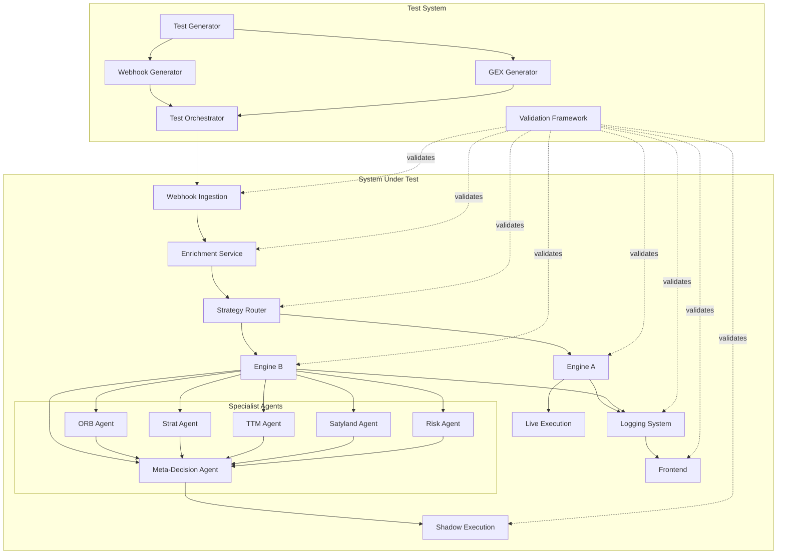

# Design Document: E2E Testing System with Synthetic Data

## Overview

This design specifies a comprehensive end-to-end testing system for a multi-agent A/B trading platform. The system validates correct behavior across webhook ingestion, A/B routing, multi-agent decision-making, shadow execution, and frontend visualization while ensuring zero production regression.

The testing architecture consists of three primary components:

1. **Synthetic Data Generators**: Create deterministic, repeatable test data for webhooks and GEX context
2. **Test Orchestration Layer**: Coordinate test execution across all system phases
3. **Validation Framework**: Verify system behavior against expected outcomes

The design prioritizes determinism, isolation, and comprehensive coverage while maintaining strict separation between test and production environments.

## Architecture

### High-Level Architecture



### Component Responsibilities

**Synthetic Data Generators**:
- Generate deterministic webhook payloads for various market scenarios
- Generate GEX data for different gamma exposure regimes
- Mark all synthetic data explicitly to prevent confusion with live data
- Provide reproducible test fixtures

**Test Orchestrator**:
- Coordinate test execution across all phases
- Inject synthetic data into the system under test
- Capture system outputs and state changes
- Provide replay functionality for debugging

**Validation Framework**:
- Verify webhook ingestion behavior (single processing, shared enrichment)
- Verify A/B routing determinism and feature flag behavior
- Verify Engine A regression prevention (no behavior changes, no latency increases)
- Verify Engine B multi-agent activation and interaction
- Verify shadow execution isolation (no broker API calls)
- Verify logging and attribution completeness
- Verify frontend display accuracy

## Components and Interfaces

### Synthetic Webhook Generator

**Purpose**: Generate deterministic TradingView webhook payloads for testing.

**Interface**:
```typescript
interface WebhookGenerator {
  generateWebhook(scenario: WebhookScenario): SyntheticWebhook;
  generateBatch(scenarios: WebhookScenario[]): SyntheticWebhook[];
}

interface WebhookScenario {
  symbol: 'SPY' | 'QQQ' | 'SPX';
  timeframe: '1m' | '5m' | '15m';
  session: 'RTH_OPEN' | 'MID_DAY' | 'POWER_HOUR';
  pattern: 'ORB_BREAKOUT' | 'ORB_FAKEOUT' | 'TREND_CONTINUATION' | 
           'CHOP' | 'VOL_COMPRESSION' | 'VOL_EXPANSION';
  price: number;
  volume: number;
  timestamp: number;
}

interface SyntheticWebhook {
  payload: WebhookPayload;
  metadata: {
    synthetic: true;
    scenario: WebhookScenario;
    generatedAt: number;
  };
}
```

**Implementation Notes**:
- Use deterministic random seed for reproducibility
- Generate realistic price/volume data based on historical patterns
- Include all fields expected by the production webhook handler
- Mark all generated data with `synthetic: true` flag

### Synthetic GEX Generator

**Purpose**: Generate deterministic gamma exposure data for testing.

**Interface**:
```typescript
interface GEXGenerator {
  generateGEX(regime: GEXRegime): SyntheticGEX;
  generateBatch(regimes: GEXRegime[]): SyntheticGEX[];
}

interface GEXRegime {
  type: 'POSITIVE' | 'NEGATIVE' | 'GAMMA_FLIP_NEAR' | 'NEUTRAL';
  symbol: string;
  spotPrice: number;
  gammaFlipLevel?: number;
}

interface SyntheticGEX {
  data: {
    total_gex: number;
    call_gex: number;
    put_gex: number;
    net_gex: number;
    gamma_flip_level: number | null;
  };
  metadata: {
    synthetic: true;
    regime: GEXRegime;
    generatedAt: number;
  };
}
```

**Implementation Notes**:
- Positive GEX: total_gex > 0, indicates pinning behavior
- Negative GEX: total_gex < 0, indicates trending behavior
- Gamma flip near: spotPrice within 1% of gamma_flip_level
- Neutral: total_gex near zero
- Ensure call_gex + put_gex = total_gex
- Ensure net_gex = call_gex - put_gex

### Test Orchestrator

**Purpose**: Coordinate test execution and data injection.

**Interface**:
```typescript
interface TestOrchestrator {
  setupTest(config: TestConfig): TestContext;
  injectWebhook(context: TestContext, webhook: SyntheticWebhook): void;
  injectGEX(context: TestContext, gex: SyntheticGEX): void;
  captureState(context: TestContext): SystemState;
  teardownTest(context: TestContext): void;
  replayTest(context: TestContext): void;
}

interface TestConfig {
  isolatedEnvironment: boolean;
  featureFlags: Record<string, boolean>;
  mockExternalAPIs: boolean;
  captureAllLogs: boolean;
}

interface TestContext {
  testId: string;
  config: TestConfig;
  startTime: number;
  injectedData: Array<SyntheticWebhook | SyntheticGEX>;
  capturedStates: SystemState[];
}

interface SystemState {
  timestamp: number;
  webhookProcessingCount: number;
  enrichmentCallCount: number;
  routerDecisions: VariantAssignment[];
  engineADecisions: Decision[];
  engineBDecisions: Decision[];
  agentActivations: AgentActivation[];
  shadowExecutions: ShadowTrade[];
  liveExecutions: LiveTrade[];
  logs: LogEntry[];
}
```

**Implementation Notes**:
- Create isolated test environment for each test run
- Mock external API calls (TwelveData, Alpaca, MarketDataApp) to prevent live calls
- Capture all system state changes for validation
- Provide replay functionality using captured test context
- Ensure test teardown cleans up all resources

### Validation Framework

**Purpose**: Verify system behavior against expected outcomes.

**Interface**:
```typescript
interface ValidationFramework {
  validateWebhookIngestion(state: SystemState, expected: WebhookIngestionExpectation): ValidationResult;
  validateRouting(state: SystemState, expected: RoutingExpectation): ValidationResult;
  validateEngineA(state: SystemState, baseline: EngineABaseline): ValidationResult;
  validateEngineB(state: SystemState, expected: EngineBExpectation): ValidationResult;
  validateShadowExecution(state: SystemState): ValidationResult;
  validateLogging(state: SystemState, expected: LoggingExpectation): ValidationResult;
  validateFrontend(frontendState: FrontendState, backendState: SystemState): ValidationResult;
  validateDeterminism(states: SystemState[]): ValidationResult;
}

interface ValidationResult {
  passed: boolean;
  phase: string;
  requirement: string;
  message: string;
  details?: any;
}

interface WebhookIngestionExpectation {
  expectedProcessingCount: number;
  expectedEnrichmentCount: number;
  expectedSnapshotSharing: boolean;
}

interface RoutingExpectation {
  expectedVariant: 'A' | 'B';
  expectedDeterminism: boolean;
  expectedFeatureFlagBehavior: boolean;
}

interface EngineABaseline {
  baselineDecisions: Decision[];
  baselineLatency: number;
  baselineExecutionMode: 'LIVE';
}

interface EngineBExpectation {
  expectedAgentActivations: string[];
  expectedDataSource: 'SHARED_SNAPSHOT';
  expectedExecutionMode: 'SHADOW';
  expectedExternalAPICalls: number;
}

interface LoggingExpectation {
  requiredFields: string[];
  expectedVariant: 'A' | 'B';
  expectedAgents: string[];
  expectedConfidence: number;
  expectedExecutionLabel: 'SHADOW' | 'LIVE';
}
```

**Implementation Notes**:
- Each validation function returns detailed results for debugging
- Validation failures include expected vs actual values
- Support for baseline comparison (Engine A regression detection)
- Determinism validation compares multiple runs with identical inputs
- Frontend validation compares rendered UI state with backend logs

## Data Models

### Webhook Payload

```typescript
interface WebhookPayload {
  symbol: string;
  timeframe: string;
  timestamp: number;
  open: number;
  high: number;
  low: number;
  close: number;
  volume: number;
  signal?: string;
  strategy?: string;
}
```

### Enriched Snapshot

```typescript
interface EnrichedSnapshot {
  webhook: WebhookPayload;
  marketData: {
    currentPrice: number;
    bid: number;
    ask: number;
    spread: number;
    dayHigh: number;
    dayLow: number;
    dayVolume: number;
  };
  gexData: {
    total_gex: number;
    call_gex: number;
    put_gex: number;
    net_gex: number;
    gamma_flip_level: number | null;
    regime: 'POSITIVE' | 'NEGATIVE' | 'GAMMA_FLIP_NEAR' | 'NEUTRAL';
  };
  technicalIndicators: {
    orbHigh?: number;
    orbLow?: number;
    ttmSqueeze?: boolean;
    trendDirection?: 'UP' | 'DOWN' | 'SIDEWAYS';
  };
  enrichedAt: number;
}
```

### Variant Assignment

```typescript
interface VariantAssignment {
  signalId: string;
  variant: 'A' | 'B';
  assignedAt: number;
  reason: string;
  featureFlags: Record<string, boolean>;
}
```

### Decision

```typescript
interface Decision {
  signalId: string;
  engine: 'A' | 'B';
  action: 'BUY' | 'SELL' | 'HOLD' | 'CLOSE';
  confidence: number;
  reasoning: string;
  decidedAt: number;
}
```

### Agent Activation

```typescript
interface AgentActivation {
  signalId: string;
  agentName: 'ORB' | 'STRAT' | 'TTM' | 'SATYLAND' | 'RISK' | 'META_DECISION';
  activated: boolean;
  input: EnrichedSnapshot;
  output: {
    recommendation: 'BUY' | 'SELL' | 'HOLD' | 'VETO';
    confidence: number;
    reasoning: string;
  };
  activatedAt: number;
}
```

### Shadow Trade

```typescript
interface ShadowTrade {
  signalId: string;
  engine: 'B';
  action: 'BUY' | 'SELL' | 'CLOSE';
  quantity: number;
  price: number;
  simulatedPnL: number;
  executedAt: number;
  brokerAPICalled: false;
}
```

### Live Trade

```typescript
interface LiveTrade {
  signalId: string;
  engine: 'A';
  action: 'BUY' | 'SELL' | 'CLOSE';
  quantity: number;
  price: number;
  orderId: string;
  executedAt: number;
  brokerAPICalled: true;
}
```

### Log Entry

```typescript
interface LogEntry {
  timestamp: number;
  level: 'INFO' | 'WARN' | 'ERROR';
  phase: string;
  signalId: string;
  variant: 'A' | 'B';
  agents?: string[];
  confidence?: number;
  executionLabel: 'SHADOW' | 'LIVE';
  gexRegime?: string;
  message: string;
  metadata: Record<string, any>;
}
```

### Frontend State

```typescript
interface FrontendState {
  displayedSignals: Array<{
    signalId: string;
    variant: 'A' | 'B';
    agents: string[];
    confidence: number;
    executionLabel: 'SHADOW' | 'LIVE';
    action: string;
    timestamp: number;
  }>;
  capturedAt: number;
}
```


## Correctness Properties

A property is a characteristic or behavior that should hold true across all valid executions of a system—essentially, a formal statement about what the system should do. Properties serve as the bridge between human-readable specifications and machine-verifiable correctness guarantees.

### Property 1: Synthetic Data Marking

*For any* synthetic webhook or GEX data generated by the Test_System, the data must be explicitly marked with `synthetic: true` in its metadata to prevent confusion with live market data.

**Validates: Requirements 1.10, 2.10, 14.5**

### Property 2: Webhook Generator Completeness

*For any* requested webhook scenario (symbol, timeframe, session, pattern combination), the generator must produce a valid webhook payload containing all required fields (symbol, timeframe, timestamp, OHLCV data) matching the requested scenario characteristics.

**Validates: Requirements 1.1, 1.2, 1.3, 1.4-1.9**

### Property 3: GEX Generator Completeness

*For any* requested GEX regime, the generator must produce valid GEX data containing all required fields (total_gex, call_gex, put_gex, net_gex, gamma_flip_level) with mathematically consistent relationships (call_gex + put_gex = total_gex, net_gex = call_gex - put_gex).

**Validates: Requirements 2.1-2.5**

### Property 4: GEX Regime Characteristics

*For any* generated GEX data, the regime type must match the mathematical characteristics: positive regime has total_gex > 0, negative regime has total_gex < 0, gamma flip near has spotPrice within 1% of gamma_flip_level, and neutral has total_gex near zero.

**Validates: Requirements 2.6-2.9**

### Property 5: Webhook Processing Idempotency

*For any* webhook payload, if the same payload is injected multiple times into the system, webhook processing and enrichment should occur exactly once (idempotent behavior).

**Validates: Requirements 3.1, 3.2**

### Property 6: Snapshot Sharing

*For any* enriched webhook, the exact same snapshot object must be passed to both Engine_A and Engine_B, ensuring shared data usage without duplication.

**Validates: Requirements 3.3**

### Property 7: Enrichment Efficiency

*For any* webhook enrichment, each external API (TwelveData, Alpaca, MarketDataApp) should be called at most once, preventing duplicate API calls.

**Validates: Requirements 3.4**

### Property 8: Routing Determinism

*For any* webhook payload, processing it multiple times through the Strategy_Router with identical system state should produce the same variant assignment every time.

**Validates: Requirements 4.1, 4.2, 13.3**

### Property 9: Variant Distribution

*For any* large batch of diverse webhook payloads, the distribution of variant assignments should match the expected A/B split ratio configured in the system.

**Validates: Requirements 4.5**

### Property 10: Routing Logging Completeness

*For any* variant assignment, the logged entry must contain all required attribution fields: signalId, variant, assignedAt, reason, and featureFlags.

**Validates: Requirements 4.4**

### Property 11: Engine A Behavioral Regression Prevention

*For any* snapshot that was processed in the baseline system, Engine_A must produce a decision identical to the baseline decision (same action, same confidence, same reasoning).

**Validates: Requirements 5.1**

### Property 12: Engine A Performance Regression Prevention

*For any* snapshot, Engine_A processing latency must not exceed the baseline latency plus an acceptable threshold (e.g., baseline + 10ms).

**Validates: Requirements 5.2**

### Property 13: Engine A Execution Isolation

*For any* Engine_A decision, only live execution should occur (no shadow execution), and the execution should be properly attributed to Engine_A.

**Validates: Requirements 5.3**

### Property 14: Conditional Agent Activation

*For any* snapshot processed by Engine_B, specialist agents should activate if and only if their activation conditions are met: ORB agent for ORB scenarios, Strat agent for trend scenarios, TTM agent for momentum scenarios, Satyland agent for confirmation scenarios, Risk agent for all decisions, and Meta-Decision agent for aggregation.

**Validates: Requirements 6.1, 6.4-6.8**

### Property 15: Agent Data Source Isolation

*For any* activated specialist agent, the input data must come exclusively from the shared snapshot (no additional external API calls), and the external API call count during agent execution must be zero.

**Validates: Requirements 6.2, 6.3**

### Property 16: Meta-Decision Aggregation

*For any* Engine_B decision, the Meta-Decision agent must receive and aggregate outputs from all other activated specialist agents before producing the final decision.

**Validates: Requirements 6.9**

### Property 17: Risk Veto Enforcement

*For any* trade proposal where the Risk agent detects adverse conditions and issues a veto, no execution (shadow or live) should occur, and the veto must be logged with the reason and full attribution.

**Validates: Requirements 7.1, 7.2, 7.3**

### Property 18: Shadow Execution Isolation

*For any* Engine_B decision, only shadow execution should occur (never live execution), broker API call count must be zero, shadow PnL tracking must be updated, and live trading state must remain unchanged.

**Validates: Requirements 8.1, 8.2, 8.3, 8.4, 8.5**

### Property 19: Multi-Agent Confidence Adjustment

*For any* Engine_B decision where multiple agents activate, confidence adjustments must follow defined rules: ORB+TTM alignment increases confidence, Strat continuation increases confidence, Strat reversal decreases confidence, Satyland confirmation increases confidence, and agent disagreement triggers Meta-Decision conflict resolution.

**Validates: Requirements 9.1, 9.2, 9.3, 9.4, 9.5**

### Property 20: GEX Regime Sensitivity

*For any* Engine_B decision with GEX data, agent confidence adjustments must reflect the GEX regime: positive GEX (pinning) adjusts for mean reversion, negative GEX (trending) adjusts for momentum, gamma flip near price increases caution, and neutral GEX uses baseline confidence.

**Validates: Requirements 10.1, 10.2, 10.3, 10.4**

### Property 21: GEX Attribution Logging

*For any* confidence adjustment based on GEX data, the log entry must include the GEX regime type and attribution showing which agent made the adjustment.

**Validates: Requirements 10.5**

### Property 22: Decision Logging Completeness

*For any* trading decision (Engine_A or Engine_B), the backend log must contain all required fields: timestamp, signalId, variant, agents (if Engine_B), confidence, executionLabel (SHADOW or LIVE), gexRegime (if available), action, and reasoning.

**Validates: Requirements 11.1-11.5**

### Property 23: Frontend-Backend Consistency

*For any* signal displayed in the frontend, the displayed data (variant, agents, confidence, executionLabel) must exactly match the corresponding backend log entry for that signalId.

**Validates: Requirements 11.6-11.9**

### Property 24: Feature Flag Kill-Switch

*For any* webhook processed when Feature_Flags disable Engine_B, the system must behave identically to the pre-experiment baseline: all signals route to Engine_A, no Engine_B code executes, no specialist agents activate, no shadow execution occurs, and all decisions match baseline behavior.

**Validates: Requirements 4.3, 5.5, 12.1, 12.2, 12.3, 12.4, 12.5**

### Property 25: Engine A Determinism

*For any* synthetic data, running Engine_A multiple times with identical inputs and system state should produce identical decisions across all runs (same action, confidence, reasoning, timing).

**Validates: Requirements 13.1**

### Property 26: Engine B Determinism

*For any* synthetic data, running Engine_B multiple times with identical inputs and system state should produce identical decisions across all runs (same agent activations, same confidence adjustments, same final decision).

**Validates: Requirements 13.2, 13.4**

### Property 27: Test Replay Determinism

*For any* captured test scenario, replaying it through the Test_System should produce identical system state, decisions, and outcomes as the original test run.

**Validates: Requirements 13.5**

### Property 28: Test Isolation Safety

*For any* test execution, the test must not make any live broker API calls, must not modify production data, and must not modify production configuration. All broker interactions must be mocked, and production state must remain unchanged after test completion.

**Validates: Requirements 14.2, 14.3, 14.4**

### Property 29: Test Report Completeness

*For any* completed test run, the generated report must include: pass/fail status for all test phases, coverage metrics for all requirements, performance metrics including latency measurements, and determinism validation results (if multiple runs were performed).

**Validates: Requirements 15.1, 15.2, 15.5, 15.6**

### Property 30: Test Failure Reporting

*For any* failed test, the report must include: detailed failure information with expected vs actual values, reproduction steps using the synthetic data that caused the failure, and sufficient context to debug the issue.

**Validates: Requirements 15.3, 15.4**


## Error Handling

### Synthetic Data Generation Errors

**Invalid Scenario Configuration**:
- When: Generator receives invalid or unsupported scenario parameters
- Response: Throw descriptive error with valid parameter options
- Recovery: Test author corrects scenario configuration

**Data Consistency Violations**:
- When: Generated GEX data violates mathematical constraints (e.g., call_gex + put_gex ≠ total_gex)
- Response: Throw error with details of the constraint violation
- Recovery: Fix generator logic to ensure consistency

### Test Orchestration Errors

**Environment Setup Failure**:
- When: Test environment cannot be isolated or initialized
- Response: Fail fast with clear error message, skip test execution
- Recovery: Fix environment configuration, retry test

**Data Injection Failure**:
- When: Synthetic data cannot be injected into system under test
- Response: Log detailed error, mark test as failed, continue with remaining tests
- Recovery: Investigate system under test, fix injection mechanism

**State Capture Failure**:
- When: System state cannot be captured during test execution
- Response: Log warning, continue test with partial state, mark validation as incomplete
- Recovery: Fix state capture mechanism, re-run test

### Validation Errors

**Assertion Failure**:
- When: System behavior does not match expected outcome
- Response: Generate detailed failure report with expected vs actual values, mark test as failed
- Recovery: Investigate root cause, fix system under test or update expectations

**Timeout**:
- When: System under test does not respond within timeout period
- Response: Mark test as failed with timeout error, capture partial state
- Recovery: Investigate performance issue or increase timeout

**Missing Data**:
- When: Expected data (logs, decisions, executions) is not present in captured state
- Response: Mark test as failed with missing data error
- Recovery: Investigate why data was not generated or captured

### Production Safety Errors

**Live API Call Detected**:
- When: Test detects an actual broker API call instead of mocked call
- Response: Immediately halt test execution, mark as critical failure, alert operators
- Recovery: Investigate why mocking failed, fix mocking mechanism, verify no production impact

**Production Data Modification Detected**:
- When: Test detects modification to production data or configuration
- Response: Immediately halt test execution, mark as critical failure, alert operators, attempt rollback
- Recovery: Investigate how production was accessed, fix isolation mechanism, verify and repair production state

**Synthetic Data Unmarked**:
- When: Generated data is missing the `synthetic: true` flag
- Response: Throw error, refuse to inject data into system
- Recovery: Fix generator to always mark synthetic data

### Error Recovery Strategies

**Graceful Degradation**:
- Non-critical validation failures allow test suite to continue
- Partial results are better than no results
- Each test phase is independent where possible

**Fail-Fast for Safety**:
- Any production safety violation immediately halts all testing
- Critical errors (live API calls, production modifications) trigger alerts
- No recovery attempted for safety violations during test run

**Detailed Error Context**:
- All errors include full context: test phase, requirement being validated, synthetic data used
- Errors include reproduction steps for debugging
- Errors reference specific properties and requirements

## Testing Strategy

### Dual Testing Approach

The testing strategy employs both **unit tests** and **property-based tests** as complementary approaches:

- **Unit tests**: Validate specific examples, edge cases, error conditions, and integration points
- **Property tests**: Validate universal properties across all inputs through randomized testing

Together, these approaches provide comprehensive coverage: unit tests catch concrete bugs in specific scenarios, while property tests verify general correctness across the input space.

### Property-Based Testing Framework

**Library Selection**: Use **fast-check** for Node.js/TypeScript property-based testing

**Configuration**:
- Minimum 100 iterations per property test (due to randomization)
- Deterministic seed for reproducibility when debugging failures
- Shrinking enabled to find minimal failing examples

**Test Tagging**:
Each property test must include a comment tag referencing its design document property:
```typescript
// Feature: e2e-testing-with-synthetic-data, Property 1: Synthetic Data Marking
```

**Property Test Structure**:
```typescript
import fc from 'fast-check';

describe('Property 1: Synthetic Data Marking', () => {
  it('should mark all synthetic webhooks with synthetic flag', () => {
    fc.assert(
      fc.property(
        webhookScenarioArbitrary(),
        (scenario) => {
          const webhook = generator.generateWebhook(scenario);
          expect(webhook.metadata.synthetic).toBe(true);
        }
      ),
      { numRuns: 100 }
    );
  });
});
```

### Test Organization

**Phase-Based Test Suites**:
- Phase 1: Synthetic Data Generation Tests
- Phase 2: Webhook Ingestion Tests
- Phase 3: Strategy Router Tests
- Phase 4: Engine A Regression Tests
- Phase 5: Engine B Multi-Agent Tests
- Phase 6: Shadow Execution Tests
- Phase 7: Logging and Attribution Tests
- Phase 8: Feature Flag Tests
- Phase 9: Determinism Tests
- Phase 10: GEX Regime Tests
- Phase 11: Integration Tests
- Phase 12: Safety and Isolation Tests

**Test Execution Order**:
1. Run synthetic data generation tests first (foundation)
2. Run safety and isolation tests early (fail fast on safety issues)
3. Run phase-specific tests in logical order
4. Run integration tests last (require all components working)

### Unit Test Coverage

**Synthetic Data Generators**:
- Test specific scenario generation (e.g., ORB breakout with SPY at RTH open)
- Test edge cases (e.g., extreme volatility, zero volume)
- Test error conditions (e.g., invalid parameters)

**Test Orchestrator**:
- Test environment setup and teardown
- Test data injection mechanisms
- Test state capture accuracy
- Test replay functionality

**Validation Framework**:
- Test each validation function with known good and bad inputs
- Test error message clarity
- Test baseline comparison logic

**Integration Points**:
- Test webhook ingestion → enrichment → routing flow
- Test routing → engine execution flow
- Test engine execution → logging → frontend flow

### Property Test Coverage

Each correctness property (Properties 1-30) must have a corresponding property-based test that:
1. Generates random valid inputs using fast-check arbitraries
2. Executes the system behavior
3. Asserts the property holds for all generated inputs
4. Runs minimum 100 iterations
5. Tags the test with the property reference

### Arbitraries for Property Testing

**Webhook Scenario Arbitrary**:
```typescript
const webhookScenarioArbitrary = () => fc.record({
  symbol: fc.constantFrom('SPY', 'QQQ', 'SPX'),
  timeframe: fc.constantFrom('1m', '5m', '15m'),
  session: fc.constantFrom('RTH_OPEN', 'MID_DAY', 'POWER_HOUR'),
  pattern: fc.constantFrom('ORB_BREAKOUT', 'ORB_FAKEOUT', 'TREND_CONTINUATION', 
                           'CHOP', 'VOL_COMPRESSION', 'VOL_EXPANSION'),
  price: fc.double({ min: 100, max: 500 }),
  volume: fc.integer({ min: 1000, max: 10000000 }),
  timestamp: fc.integer({ min: 1640000000000, max: 1700000000000 })
});
```

**GEX Regime Arbitrary**:
```typescript
const gexRegimeArbitrary = () => fc.record({
  type: fc.constantFrom('POSITIVE', 'NEGATIVE', 'GAMMA_FLIP_NEAR', 'NEUTRAL'),
  symbol: fc.constantFrom('SPY', 'QQQ', 'SPX'),
  spotPrice: fc.double({ min: 100, max: 500 }),
  gammaFlipLevel: fc.option(fc.double({ min: 100, max: 500 }))
});
```

**Snapshot Arbitrary**:
```typescript
const snapshotArbitrary = () => fc.record({
  webhook: webhookPayloadArbitrary(),
  marketData: marketDataArbitrary(),
  gexData: gexDataArbitrary(),
  technicalIndicators: technicalIndicatorsArbitrary(),
  enrichedAt: fc.integer({ min: 1640000000000, max: 1700000000000 })
});
```

### Test Isolation Mechanisms

**Environment Isolation**:
- Use separate test database (or in-memory database)
- Use test-specific configuration files
- Use dependency injection to replace production services with test doubles

**API Mocking**:
- Mock all external APIs (TwelveData, Alpaca, MarketDataApp, broker APIs)
- Use libraries like `nock` or `msw` for HTTP mocking
- Verify that mocked APIs are called with expected parameters
- Verify that no unmocked APIs are called during tests

**State Isolation**:
- Reset all state between tests
- Use test fixtures for initial state
- Capture and restore state for replay tests

### Performance Testing

**Latency Measurement**:
- Measure Engine A processing latency for regression detection
- Measure end-to-end latency from webhook to decision
- Compare against baseline with acceptable thresholds

**Load Testing**:
- Test with high volume of concurrent webhooks
- Verify system handles load without degradation
- Verify no memory leaks during extended test runs

### Determinism Validation

**Multi-Run Testing**:
- Run each determinism test 3 times with identical inputs
- Compare all outputs for exact equality
- Report any non-deterministic behavior as failure

**Seed Control**:
- Use fixed seeds for property-based tests during determinism validation
- Document seeds used for reproducibility

### Frontend Testing

**Approach**: Use Playwright for frontend E2E testing (if needed)

**Test Scenarios**:
- Verify frontend displays correct variant assignment
- Verify frontend displays activated agents
- Verify frontend displays confidence scores
- Verify frontend displays shadow/live labels
- Verify frontend updates in real-time as decisions are made

**Frontend-Backend Consistency**:
- Capture backend logs during test
- Capture frontend displayed data
- Assert exact match between backend and frontend

### Continuous Integration

**Test Execution**:
- Run full test suite on every commit
- Run extended property tests (1000+ iterations) nightly
- Run performance regression tests on release candidates

**Failure Handling**:
- Block merges on test failures
- Generate detailed failure reports with reproduction steps
- Alert team on safety violation failures

**Coverage Tracking**:
- Track requirement coverage (all 15 requirements)
- Track property coverage (all 30 properties)
- Track code coverage (aim for >80% for test system code)

### Test Maintenance

**Baseline Updates**:
- Update Engine A baseline when intentional changes are made
- Document baseline changes with rationale
- Version baselines for historical comparison

**Test Data Updates**:
- Periodically review and update synthetic data scenarios
- Add new scenarios as new market patterns emerge
- Maintain library of edge cases discovered through testing

**Test Review**:
- Review test failures for patterns indicating systemic issues
- Review test coverage gaps quarterly
- Update tests as system evolves
