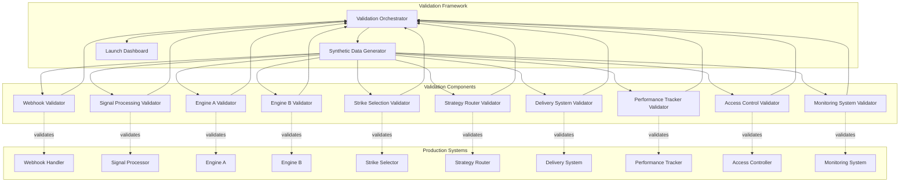
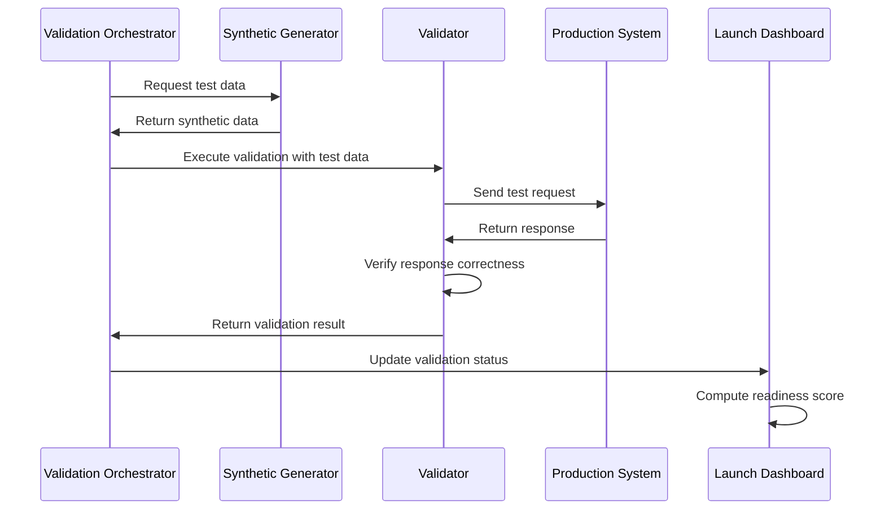

# Design Document: GTM Launch Readiness Validation

## Overview

The GTM Launch Readiness Validation system is a comprehensive testing and monitoring framework that validates the complete options trading platform lifecycle from webhook ingestion to signal delivery. The system provides automated validation of all critical components, synthetic data generation for realistic testing scenarios, and a launch readiness dashboard that provides clear go/no-go criteria for production launch.

The validation framework is designed to be non-destructive, repeatable, and automatable. It validates 10 key areas: webhook infrastructure, signal processing, both decision engines (A and B), strike selection, strategy routing, signal delivery, performance tracking, access control, and monitoring systems. Each validation produces clear pass/fail results with detailed diagnostics.

The system architecture separates validation logic from production systems to ensure testing does not interfere with live trading. Synthetic data generators create realistic test scenarios including edge cases, and the launch dashboard aggregates validation results into an overall readiness score.

## Architecture

### High-Level Architecture



### Component Interaction Flow



### Validation Execution Model

The validation framework uses a phased execution model:

1. **Setup Phase**: Generate synthetic data and prepare test environment
2. **Execution Phase**: Run validators in dependency order
3. **Verification Phase**: Check responses against expected outcomes
4. **Reporting Phase**: Aggregate results and update dashboard
5. **Cleanup Phase**: Remove test data and restore state

Validators can run in parallel when they have no dependencies. Critical path validations (webhook → signal → engine → delivery) run sequentially to validate end-to-end flow.

## Components and Interfaces

### Validation Orchestrator

**Responsibility**: Coordinates validation execution, manages dependencies, and aggregates results.

**Interface**:
```typescript
interface ValidationOrchestrator {
  // Execute all validations
  runFullValidation(): Promise<ValidationReport>
  
  // Execute specific validation category
  runValidation(category: ValidationCategory): Promise<ValidationResult>
  
  // Execute validations in dependency order
  runValidationSequence(categories: ValidationCategory[]): Promise<ValidationReport>
  
  // Get current validation status
  getValidationStatus(): ValidationStatus
}

interface ValidationReport {
  overallStatus: 'PASS' | 'FAIL' | 'PARTIAL'
  readinessScore: number  // 0-100
  categoryResults: Map<ValidationCategory, ValidationResult>
  executionTime: number
  timestamp: Date
  blockingIssues: Issue[]
}

interface ValidationResult {
  category: ValidationCategory
  status: 'PASS' | 'FAIL'
  testsPassed: number
  testsFailed: number
  executionTime: number
  failures: ValidationFailure[]
}

enum ValidationCategory {
  WEBHOOK_INFRASTRUCTURE,
  SIGNAL_PROCESSING,
  ENGINE_A,
  ENGINE_B,
  STRIKE_SELECTION,
  STRATEGY_ROUTING,
  SIGNAL_DELIVERY,
  PERFORMANCE_TRACKING,
  ACCESS_CONTROL,
  MONITORING,
  END_TO_END,
  KILL_SWITCHES
}
```

### Synthetic Data Generator

**Responsibility**: Creates realistic test data for all validation scenarios.

**Interface**:
```typescript
interface SyntheticDataGenerator {
  // Generate webhook payloads
  generateWebhook(params: WebhookParams): WebhookPayload
  
  // Generate market context data
  generateMarketContext(params: MarketParams): MarketContext
  
  // Generate user profiles
  generateUser(tier: SubscriptionTier): UserProfile
  
  // Generate position data
  generatePosition(params: PositionParams): Position
  
  // Generate edge case scenarios
  generateEdgeCase(scenario: EdgeCaseScenario): TestScenario
  
  // Generate time series data
  generateTimeSeries(params: TimeSeriesParams): TimeSeriesData
}

interface WebhookParams {
  strategy: string
  timeframe: string
  direction: 'LONG' | 'SHORT'
  confidence?: number
  includeSignature?: boolean
  malformed?: boolean
}

interface MarketParams {
  volatility: 'LOW' | 'MEDIUM' | 'HIGH' | 'EXTREME'
  liquidity: 'LOW' | 'MEDIUM' | 'HIGH'
  gexLevel: number
  marketHours: boolean
}

enum EdgeCaseScenario {
  EXTREME_VOLATILITY,
  LOW_LIQUIDITY,
  CONFLICTING_SIGNALS,
  MARKET_CLOSED,
  DUPLICATE_WEBHOOK,
  MALFORMED_PAYLOAD,
  MISSING_FIELDS,
  INVALID_SIGNATURE
}
```

### Webhook Validator

**Responsibility**: Validates webhook infrastructure including authentication, payload validation, retries, and dead-letter queue.

**Interface**:
```typescript
interface WebhookValidator {
  // Validate webhook URL configuration
  validateWebhookUrl(): Promise<ValidationResult>
  
  // Validate authentication with valid signature
  validateAuthenticationSuccess(): Promise<ValidationResult>
  
  // Validate authentication rejection with invalid signature
  validateAuthenticationFailure(): Promise<ValidationResult>
  
  // Validate payload logging
  validatePayloadLogging(): Promise<ValidationResult>
  
  // Validate malformed payload rejection
  validatePayloadValidation(): Promise<ValidationResult>
  
  // Validate retry logic
  validateRetryMechanism(): Promise<ValidationResult>
  
  // Validate idempotency
  validateIdempotency(): Promise<ValidationResult>
  
  // Validate dead-letter queue
  validateDeadLetterQueue(): Promise<ValidationResult>
}
```

### Signal Processing Validator

**Responsibility**: Validates signal parsing, normalization, and market context enrichment.

**Interface**:
```typescript
interface SignalProcessingValidator {
  // Validate field extraction
  validateFieldExtraction(): Promise<ValidationResult>
  
  // Validate normalization consistency
  validateNormalization(): Promise<ValidationResult>
  
  // Validate market context enrichment
  validateMarketEnrichment(): Promise<ValidationResult>
  
  // Validate signal versioning
  validateVersioning(): Promise<ValidationResult>
  
  // Validate missing field handling
  validateMissingFieldRejection(): Promise<ValidationResult>
  
  // Validate confidence normalization
  validateConfidenceNormalization(): Promise<ValidationResult>
}
```

### Engine A Validator

**Responsibility**: Validates rule-based decision engine logic including all three tiers and exit logic.

**Interface**:
```typescript
interface EngineAValidator {
  // Validate tier 1 hard blocks
  validateTier1HardBlocks(): Promise<ValidationResult>
  
  // Validate tier 1 rejection
  validateTier1Rejection(): Promise<ValidationResult>
  
  // Validate tier 2 delays
  validateTier2Delays(): Promise<ValidationResult>
  
  // Validate tier 2 queueing
  validateTier2Queueing(): Promise<ValidationResult>
  
  // Validate tier 3 entry rules
  validateTier3EntryRules(): Promise<ValidationResult>
  
  // Validate exit tier evaluation
  validateExitTiers(): Promise<ValidationResult>
  
  // Validate exit recommendation generation
  validateExitRecommendation(): Promise<ValidationResult>
  
  // Validate no-action scenarios
  validateNoActionRecommendation(): Promise<ValidationResult>
}
```

### Engine B Validator

**Responsibility**: Validates multi-agent decision engine including orchestration, agent context, and voting.

**Interface**:
```typescript
interface EngineBValidator {
  // Validate meta-decision agent orchestration
  validateMetaAgentOrchestration(): Promise<ValidationResult>
  
  // Validate Context Agent receives correct data
  validateContextAgentData(): Promise<ValidationResult>
  
  // Validate Technical Agent receives correct data
  validateTechnicalAgentData(): Promise<ValidationResult>
  
  // Validate Risk Agent receives correct data
  validateRiskAgentData(): Promise<ValidationResult>
  
  // Validate Specialist Agent receives correct data
  validateSpecialistAgentData(): Promise<ValidationResult>
  
  // Validate confidence score normalization
  validateConfidenceNormalization(): Promise<ValidationResult>
  
  // Validate weighted voting
  validateWeightedVoting(): Promise<ValidationResult>
  
  // Validate Risk Agent veto
  validateRiskAgentVeto(): Promise<ValidationResult>
  
  // Validate disagreement flagging
  validateDisagreementFlagging(): Promise<ValidationResult>
}
```

### Strike Selection Validator

**Responsibility**: Validates strike filtering, scoring, Greeks calculation, and output formatting.

**Interface**:
```typescript
interface StrikeSelectionValidator {
  // Validate DTE filtering
  validateDTEFiltering(): Promise<ValidationResult>
  
  // Validate Greek filtering
  validateGreekFiltering(): Promise<ValidationResult>
  
  // Validate liquidity filtering
  validateLiquidityFiltering(): Promise<ValidationResult>
  
  // Validate strike scoring
  validateStrikeScoring(): Promise<ValidationResult>
  
  // Validate strike ranking
  validateStrikeRanking(): Promise<ValidationResult>
  
  // Validate Greeks calculation
  validateGreeksCalculation(): Promise<ValidationResult>
  
  // Validate output formatting
  validateOutputFormatting(): Promise<ValidationResult>
}
```

### Strategy Router Validator

**Responsibility**: Validates feature flag routing, engine assignment, and shadow execution.

**Interface**:
```typescript
interface StrategyRouterValidator {
  // Validate feature flag checking
  validateFeatureFlagCheck(): Promise<ValidationResult>
  
  // Validate Engine A routing
  validateEngineARouting(): Promise<ValidationResult>
  
  // Validate Engine B routing
  validateEngineBRouting(): Promise<ValidationResult>
  
  // Validate shadow execution
  validateShadowExecution(): Promise<ValidationResult>
  
  // Validate comparison metrics logging
  validateComparisonMetrics(): Promise<ValidationResult>
  
  // Validate routing configuration changes
  validateRoutingConfigChanges(): Promise<ValidationResult>
}
```

### Delivery System Validator

**Responsibility**: Validates signal queueing, delivery, confirmations, retries, and latency tracking.

**Interface**:
```typescript
interface DeliverySystemValidator {
  // Validate signal queueing
  validateSignalQueueing(): Promise<ValidationResult>
  
  // Validate dashboard delivery
  validateDashboardDelivery(): Promise<ValidationResult>
  
  // Validate delivery confirmation
  validateDeliveryConfirmation(): Promise<ValidationResult>
  
  // Validate delivery retries
  validateDeliveryRetries(): Promise<ValidationResult>
  
  // Validate latency tracking
  validateLatencyTracking(): Promise<ValidationResult>
  
  // Validate latency warnings
  validateLatencyWarnings(): Promise<ValidationResult>
}
```

### Performance Tracker Validator

**Responsibility**: Validates trade tracking, P&L calculation, metrics computation, and dashboard display.

**Interface**:
```typescript
interface PerformanceTrackerValidator {
  // Validate trade record creation
  validateTradeRecordCreation(): Promise<ValidationResult>
  
  // Validate P&L calculation
  validatePnLCalculation(): Promise<ValidationResult>
  
  // Validate win rate computation
  validateWinRateComputation(): Promise<ValidationResult>
  
  // Validate R-multiple computation
  validateRMultipleComputation(): Promise<ValidationResult>
  
  // Validate metric aggregation
  validateMetricAggregation(): Promise<ValidationResult>
  
  // Validate dashboard display
  validateDashboardDisplay(): Promise<ValidationResult>
  
  // Validate incomplete data handling
  validateIncompleteDataHandling(): Promise<ValidationResult>
}
```

### Access Control Validator

**Responsibility**: Validates authentication, subscription enforcement, revocation, and usage limits.

**Interface**:
```typescript
interface AccessControlValidator {
  // Validate user authentication
  validateAuthentication(): Promise<ValidationResult>
  
  // Validate subscription tier enforcement
  validateSubscriptionEnforcement(): Promise<ValidationResult>
  
  // Validate subscription expiration
  validateSubscriptionExpiration(): Promise<ValidationResult>
  
  // Validate usage limit tracking
  validateUsageLimitTracking(): Promise<ValidationResult>
  
  // Validate usage limit enforcement
  validateUsageLimitEnforcement(): Promise<ValidationResult>
  
  // Validate admin revocation
  validateAdminRevocation(): Promise<ValidationResult>
}
```

### Monitoring System Validator

**Responsibility**: Validates health checks, latency measurement, error capture, alerting, and dashboard display.

**Interface**:
```typescript
interface MonitoringSystemValidator {
  // Validate health checks
  validateHealthChecks(): Promise<ValidationResult>
  
  // Validate latency measurement
  validateLatencyMeasurement(): Promise<ValidationResult>
  
  // Validate error capture
  validateErrorCapture(): Promise<ValidationResult>
  
  // Validate error alerting
  validateErrorAlerting(): Promise<ValidationResult>
  
  // Validate admin dashboard
  validateAdminDashboard(): Promise<ValidationResult>
  
  // Validate service degradation marking
  validateServiceDegradation(): Promise<ValidationResult>
}
```

### Launch Dashboard

**Responsibility**: Displays validation status, readiness score, and blocking issues.

**Interface**:
```typescript
interface LaunchDashboard {
  // Display validation status for all categories
  displayValidationStatus(): void
  
  // Display failure details and remediation
  displayFailureDetails(category: ValidationCategory): void
  
  // Compute and display readiness score
  displayReadinessScore(): void
  
  // Display blocking issues
  displayBlockingIssues(): void
  
  // Display launch readiness recommendation
  displayLaunchReadiness(): void
  
  // Display historical validation trends
  displayHistoricalTrends(): void
}

interface ValidationStatusDisplay {
  category: ValidationCategory
  status: 'PASS' | 'FAIL' | 'RUNNING'
  testsPassed: number
  totalTests: number
  lastRun: Date
  criticality: 'CRITICAL' | 'HIGH' | 'MEDIUM' | 'LOW'
}
```

## Data Models

### Validation Result Models

```typescript
interface ValidationResult {
  category: ValidationCategory
  status: 'PASS' | 'FAIL'
  testsPassed: number
  testsFailed: number
  executionTime: number
  timestamp: Date
  failures: ValidationFailure[]
}

interface ValidationFailure {
  testName: string
  expectedOutcome: string
  actualOutcome: string
  errorMessage: string
  stackTrace?: string
  context: Record<string, any>
}

interface ValidationReport {
  overallStatus: 'PASS' | 'FAIL' | 'PARTIAL'
  readinessScore: number
  categoryResults: Map<ValidationCategory, ValidationResult>
  executionTime: number
  timestamp: Date
  blockingIssues: Issue[]
  recommendations: string[]
}

interface Issue {
  category: ValidationCategory
  severity: 'CRITICAL' | 'HIGH' | 'MEDIUM' | 'LOW'
  description: string
  remediation: string
  blocking: boolean
}
```

### Synthetic Data Models

```typescript
interface WebhookPayload {
  strategy: string
  timeframe: string
  direction: 'LONG' | 'SHORT'
  confidence: number
  timestamp: Date
  signature?: string
  metadata: Record<string, any>
}

interface MarketContext {
  gexLevel: number
  volatilityIndex: number
  liquidityScore: number
  marketRegime: 'BULLISH' | 'BEARISH' | 'NEUTRAL' | 'VOLATILE'
  marketHours: boolean
  timestamp: Date
}

interface UserProfile {
  userId: string
  subscriptionTier: 'FREE' | 'BASIC' | 'PREMIUM' | 'ENTERPRISE'
  signalQuota: number
  signalsUsed: number
  engineAssignment: 'A' | 'B'
  active: boolean
}

interface Position {
  positionId: string
  symbol: string
  strike: number
  expiration: Date
  direction: 'LONG' | 'SHORT'
  entryPrice: number
  currentPrice: number
  quantity: number
  greeks: Greeks
  pnl: number
}

interface Greeks {
  delta: number
  gamma: number
  theta: number
  vega: number
  rho: number
}
```

### Test Scenario Models

```typescript
interface TestScenario {
  scenarioId: string
  name: string
  description: string
  category: ValidationCategory
  testData: any
  expectedOutcome: any
  edgeCase: boolean
}

interface EndToEndScenario {
  webhook: WebhookPayload
  marketContext: MarketContext
  user: UserProfile
  expectedDecision: Decision
  expectedStrike?: Strike
  expectedDelivery: boolean
  maxLatency: number
}
```

## Correctness Properties

*A property is a characteristic or behavior that should hold true across all valid executions of a system—essentially, a formal statement about what the system should do. Properties serve as the bridge between human-readable specifications and machine-verifiable correctness guarantees.*


### Property Reflection

After analyzing all acceptance criteria, I've identified several areas where properties can be consolidated:

**Redundancy Analysis:**
- Properties 1.2 and 1.3 (valid/invalid signature authentication) can be combined into a single property about authentication correctness
- Properties 6.2 and 6.3 (Engine A/B routing) can be combined into a single property about routing correctness
- Properties 7.2 and 7.5 both measure latency - can be combined into comprehensive latency property
- Properties 8.3 and 8.4 (win rate and R-multiple) are both metric calculations - can be combined
- Properties 10.1 and 10.6 both deal with service health - can be combined
- Many "validation works" properties can be consolidated into broader validation correctness properties

**Consolidation Strategy:**
- Group related validation checks into comprehensive properties
- Combine authentication/authorization checks
- Merge latency and performance measurements
- Consolidate metric calculation properties
- Group error handling and retry logic

### Correctness Properties

**Property 1: Webhook Authentication Correctness**
*For any* webhook payload with signature, authentication should succeed if and only if the signature is valid
**Validates: Requirements 1.2, 1.3**

**Property 2: Webhook Idempotency**
*For any* webhook with idempotency key, processing it multiple times should produce the same result as processing it once
**Validates: Requirements 1.7**

**Property 3: Webhook Retry and DLQ**
*For any* webhook that fails processing, it should be retried with exponential backoff, and if all retries fail, it should appear in the Dead Letter Queue
**Validates: Requirements 1.6, 1.8**

**Property 4: Webhook Logging Completeness**
*For any* valid webhook received, it should appear in logs with timestamp and source information
**Validates: Requirements 1.4**

**Property 5: Malformed Payload Rejection**
*For any* malformed webhook payload, it should be rejected with a descriptive error message
**Validates: Requirements 1.5**

**Property 6: Signal Field Extraction Completeness**
*For any* valid webhook payload, all required fields (strategy, timeframe, direction, confidence) should be extracted
**Validates: Requirements 2.1**

**Property 7: Signal Normalization Consistency**
*For any* signal processed, the normalized output should have consistent field names and data types
**Validates: Requirements 2.2**

**Property 8: Market Context Enrichment Completeness**
*For any* signal processed, the enriched output should contain GEX data, volatility metrics, and liquidity indicators
**Validates: Requirements 2.3**

**Property 9: Signal Versioning Uniqueness**
*For any* two signals processed at different times, they should have unique version identifiers
**Validates: Requirements 2.4**

**Property 10: Missing Field Rejection**
*For any* webhook payload with missing required fields, it should be rejected with a descriptive error message
**Validates: Requirements 2.5**

**Property 11: Confidence Normalization Range**
*For any* signal with confidence value, the normalized confidence should be in the range 0-100
**Validates: Requirements 2.6**

**Property 12: Engine A Tier Evaluation Order**
*For any* signal entering Engine A, tiers should be evaluated in order (tier 1, then tier 2, then tier 3), stopping at first blocking condition
**Validates: Requirements 3.1, 3.3, 3.5**

**Property 13: Engine A Tier 1 Hard Block**
*For any* signal that violates tier 1 conditions (liquidity or market hours), it should be rejected immediately with block reason
**Validates: Requirements 3.2**

**Property 14: Engine A Tier 2 Delay Queueing**
*For any* signal that triggers tier 2 delay conditions, it should be queued with delay reason
**Validates: Requirements 3.4**

**Property 15: Engine A Exit Tier Ordering**
*For any* position being monitored, exit tiers should be evaluated in order: hard fail, protection, profit, degradation
**Validates: Requirements 3.6**

**Property 16: Engine A Exit Recommendation Completeness**
*For any* position meeting exit conditions, the exit recommendation should include tier identifier and reason
**Validates: Requirements 3.7**

**Property 17: Engine B Meta-Agent Orchestration**
*For any* signal entering Engine B, the meta-decision agent should be invoked to orchestrate evaluation
**Validates: Requirements 4.1**

**Property 18: Engine B Agent Context Completeness**
*For any* agent invoked in Engine B, it should receive all required context data specific to its role (Context Agent: market regime/GEX/volatility, Technical Agent: price action/indicators, Risk Agent: exposure/limits, Specialist Agent: strategy-specific data)
**Validates: Requirements 4.2, 4.3, 4.4, 4.5**

**Property 19: Engine B Confidence Normalization**
*For any* agent decision in Engine B, confidence scores should be normalized to 0-100 scale
**Validates: Requirements 4.6**

**Property 20: Engine B Weighted Voting**
*For any* set of agent decisions, the final decision should be computed using weighted voting based on confidence scores
**Validates: Requirements 4.7**

**Property 21: Engine B Risk Agent Veto Authority**
*For any* signal where Risk Agent issues veto, the signal should be rejected regardless of other agent votes
**Validates: Requirements 4.8**

**Property 22: Engine B Disagreement Flagging**
*For any* set of agent decisions with significant disagreement, the decision should be flagged for manual review
**Validates: Requirements 4.9**

**Property 85: Engine B GEX Logic Validation**
*For any* signal processed by Engine B, GEX (Gamma Exposure) data should be properly utilized by Context Agent and Gamma Flow Specialist, with different GEX regimes (positive/negative) influencing decision confidence and bias
**Validates: Requirements 4.2, 4.5**

**Property 23: Strike Filtering Correctness**
*For any* set of strikes, only those passing all filters (DTE range, Greek ranges, liquidity threshold) should remain after filtering
**Validates: Requirements 5.1, 5.2, 5.3**

**Property 24: Strike Scoring Completeness**
*For any* strike being scored, the composite score should incorporate Greeks, liquidity, and distance from current price
**Validates: Requirements 5.4**

**Property 25: Strike Ranking Order**
*For any* set of strikes passing filters, they should be ranked by composite score in descending order
**Validates: Requirements 5.5**

**Property 26: Strike Greeks Validation**
*For any* strike with calculated Greeks, delta, gamma, theta, and vega should be within expected ranges
**Validates: Requirements 5.6**

**Property 27: Strike Output Format Consistency**
*For any* strike output, it should contain standardized fields: strike price, expiration, Greeks, and score
**Validates: Requirements 5.7**

**Property 28: Strategy Router Engine Assignment**
*For any* user assigned to an engine (A or B), all their signals should be routed exclusively to that engine
**Validates: Requirements 6.2, 6.3**

**Property 29: Shadow Execution Completeness**
*For any* signal when shadow execution is enabled, both engines should be executed and outputs captured for comparison
**Validates: Requirements 6.4**

**Property 30: Shadow Execution Metrics Logging**
*For any* shadow execution completion, comparison metrics (decision agreement, confidence delta) should be logged
**Validates: Requirements 6.5**

**Property 31: Routing Configuration Isolation**
*For any* routing configuration change, in-flight signals should continue using the old configuration while new signals use the new configuration
**Validates: Requirements 6.6**

**Property 32: Signal Delivery Queueing with Priority**
*For any* approved signal, it should be queued for delivery with priority based on signal urgency
**Validates: Requirements 7.1**

**Property 33: Dashboard Delivery Latency**
*For any* signal delivered to dashboard, it should appear in the user interface within 1 second
**Validates: Requirements 7.2**

**Property 34: Delivery Confirmation Recording**
*For any* delivery attempt, a confirmation record should be created with timestamp and delivery channel
**Validates: Requirements 7.3**

**Property 35: Delivery Retry with Exponential Backoff**
*For any* failed delivery, retries should follow exponential backoff pattern up to 3 attempts
**Validates: Requirements 7.4**

**Property 36: End-to-End Latency Tracking**
*For any* signal processed, latency should be tracked from webhook receipt to delivery confirmation
**Validates: Requirements 7.5**

**Property 37: Latency Warning Threshold**
*For any* signal with latency exceeding 3 seconds, a performance warning should be logged with bottleneck identification
**Validates: Requirements 7.6**

**Property 38: Trade Record Creation Completeness**
*For any* delivered signal, a trade record should be created with entry details and unique tracking identifier
**Validates: Requirements 8.1**

**Property 39: P&L Calculation Correctness**
*For any* closed position, P&L should equal (exit price - entry price) * quantity * multiplier
**Validates: Requirements 8.2**

**Property 40: Performance Metrics Calculation**
*For any* set of trades, win rate should equal (winning trades / total trades) * 100, and R-multiple should equal profit / initial risk
**Validates: Requirements 8.3, 8.4**

**Property 41: Performance Aggregation Grouping**
*For any* set of trades, metrics should be grouped by strategy, timeframe, and decision engine
**Validates: Requirements 8.5**

**Property 42: Performance Dashboard Completeness**
*For any* performance dashboard display, it should show cumulative P&L, win rate, average R-multiple, and trade count
**Validates: Requirements 8.6**

**Property 43: Incomplete Trade Exclusion**
*For any* trade with incomplete data, it should be marked as pending and excluded from aggregate calculations
**Validates: Requirements 8.7**

**Property 44: Authentication Session Establishment**
*For any* valid user credentials, authentication should establish an authenticated session
**Validates: Requirements 9.1**

**Property 45: Subscription Tier Enforcement**
*For any* signal access check, access should be granted if and only if the user's subscription tier permits that signal type
**Validates: Requirements 9.2**

**Property 46: Subscription Expiration Revocation**
*For any* expired subscription, access to premium signals should be revoked immediately
**Validates: Requirements 9.3**

**Property 47: Usage Limit Tracking and Enforcement**
*For any* signal delivery, the user's delivery count should be incremented and checked against tier limit, blocking delivery if limit is exceeded
**Validates: Requirements 9.4, 9.5**

**Property 48: Admin Revocation Speed**
*For any* admin revocation action, active sessions should be terminated and new authentication prevented within 5 seconds
**Validates: Requirements 9.6**

**Property 49: Health Check Response Time**
*For any* health check performed, all critical services should respond within 500ms
**Validates: Requirements 10.1**

**Property 50: Stage-by-Stage Latency Tracking**
*For any* signal processed, latency should be tracked at each stage: webhook receipt, signal processing, decision engine, strike selection, and delivery
**Validates: Requirements 10.2**

**Property 51: Error Capture Completeness**
*For any* error that occurs, error details should include stack trace, context, and timestamp
**Validates: Requirements 10.3**

**Property 52: Error Rate Alerting**
*For any* period where error rate exceeds threshold, an alert should be triggered to operations team within 30 seconds
**Validates: Requirements 10.4**

**Property 53: Monitoring Dashboard Completeness**
*For any* admin dashboard display, it should show service health status, current latency metrics, and error rates
**Validates: Requirements 10.5**

**Property 54: Service Degradation Marking**
*For any* service that becomes unhealthy, it should be marked as degraded with recovery recommendations displayed
**Validates: Requirements 10.6**

**Property 55: Synthetic Webhook Format Validity**
*For any* generated webhook payload, it should match valid TradingView webhook format with realistic values
**Validates: Requirements 11.1**

**Property 56: Synthetic Market Context Realism**
*For any* generated market context, GEX levels, volatility metrics, and liquidity indicators should be within realistic ranges
**Validates: Requirements 11.2**

**Property 57: Synthetic Edge Case Coverage**
*For any* edge case generation request, the output should include scenarios for extreme volatility, low liquidity, and conflicting signals
**Validates: Requirements 11.3**

**Property 58: Synthetic User Profile Diversity**
*For any* batch of generated users, they should span all subscription tiers (FREE, BASIC, PREMIUM, ENTERPRISE)
**Validates: Requirements 11.4**

**Property 59: Synthetic Position Realism**
*For any* generated position, it should have realistic entry prices, Greeks, and P&L values
**Validates: Requirements 11.5**

**Property 60: Synthetic Time Series Coverage**
*For any* generated time series, it should include sequences for market hours, after-hours, and weekend periods
**Validates: Requirements 11.6**

**Property 61: End-to-End Flow Completeness**
*For any* end-to-end test, all stages (webhook receipt, signal processing, decision engine, strike selection, delivery) should be executed in order
**Validates: Requirements 12.1**

**Property 62: Happy Path Latency Bound**
*For any* happy path test, signal flow from webhook to delivery should complete within 3 seconds
**Validates: Requirements 12.2**

**Property 63: Rejection Path Correctness**
*For any* signal that should be blocked, it should be rejected with appropriate reason and not delivered
**Validates: Requirements 12.3**

**Property 64: Error Handling Completeness**
*For any* component failure, retries should be attempted and failed items should be stored in dead-letter queue
**Validates: Requirements 12.4**

**Property 65: Concurrent Processing Safety**
*For any* set of simultaneous signals, they should be processed without race conditions or data corruption
**Validates: Requirements 12.5**

**Property 66: End-to-End Idempotency**
*For any* duplicate signal sent through the complete pipeline, it should be detected and not processed twice
**Validates: Requirements 12.6**

**Property 67: Launch Dashboard Category Display**
*For any* validation run, the dashboard should display pass/fail status for each validation category
**Validates: Requirements 13.1**

**Property 68: Launch Dashboard Failure Details**
*For any* failed validation, the dashboard should display failure reason and remediation steps
**Validates: Requirements 13.2**

**Property 69: Readiness Score Calculation**
*For any* set of validation results, readiness score should equal (sum of weighted passing validations / sum of all weighted validations) * 100
**Validates: Requirements 13.3**

**Property 70: Readiness Warning Threshold**
*For any* readiness score below 95%, the dashboard should display warning and list blocking issues
**Validates: Requirements 13.4**

**Property 71: Launch Readiness Green Status**
*For any* validation run where all critical validations pass, the dashboard should display green status
**Validates: Requirements 13.5**

**Property 72: Historical Trend Display**
*For any* dashboard view, historical validation pass rates over time should be displayed
**Validates: Requirements 13.6**

**Property 73: Validation Execution Order**
*For any* validation suite execution, categories should be executed in dependency order
**Validates: Requirements 14.1**

**Property 74: Validation Failure Isolation**
*For any* validation that fails, remaining validations should continue executing and all failures should be reported
**Validates: Requirements 14.2**

**Property 75: Validation Report Completeness**
*For any* completed validation run, the report should include pass/fail status, execution time, and error details for each category
**Validates: Requirements 14.3**

**Property 76: Validation Scheduling Automation**
*For any* configured schedule, validation suite should execute automatically without manual intervention
**Validates: Requirements 14.4**

**Property 77: Validation Change Notification**
*For any* validation result change, a notification should be sent to operations team with summary of changes
**Validates: Requirements 14.5**

**Property 78: Validation Export Format**
*For any* validation result export, the output should be valid JSON containing all validation data
**Validates: Requirements 14.6**

**Property 79: Global Kill Switch Speed**
*For any* global kill switch activation, all signal processing should stop within 2 seconds
**Validates: Requirements 15.1**

**Property 80: Strategy Kill Switch Selectivity**
*For any* strategy-specific kill switch activation, only signals for that strategy should be blocked while other strategies continue
**Validates: Requirements 15.2**

**Property 81: User Kill Switch Immediacy**
*For any* user-specific kill switch activation, signal delivery to that user should stop immediately
**Validates: Requirements 15.3**

**Property 82: Kill Switch Deactivation Recovery**
*For any* kill switch deactivation, signal processing should resume without requiring system restart
**Validates: Requirements 15.4**

**Property 83: Emergency Stop Data Preservation**
*For any* emergency stop trigger, all in-flight signals should be persisted and no data should be lost
**Validates: Requirements 15.5**

**Property 84: Circuit Breaker Automatic Shutdown**
*For any* period where error rate exceeds circuit breaker threshold, automatic shutdown should occur
**Validates: Requirements 15.6**

## Error Handling

### Error Categories

The validation framework handles four categories of errors:

1. **Configuration Errors**: Missing or invalid configuration (webhook URL, feature flags, credentials)
2. **Validation Errors**: Test failures indicating production system issues
3. **Infrastructure Errors**: Network failures, service unavailability, timeouts
4. **Data Errors**: Invalid synthetic data, corrupted test data, missing test fixtures

### Error Handling Strategy

**Configuration Errors**:
- Fail fast during validation setup
- Provide clear error messages with remediation steps
- Prevent validation execution until configuration is fixed
- Log configuration errors to admin dashboard

**Validation Errors**:
- Continue executing remaining validations
- Capture detailed failure information (expected vs actual, context, stack trace)
- Aggregate all failures in validation report
- Mark validation category as FAIL
- Update launch dashboard with failure details

**Infrastructure Errors**:
- Retry with exponential backoff (3 attempts)
- If retries exhausted, mark validation as FAIL with infrastructure error reason
- Log infrastructure errors separately for operations team
- Provide network diagnostics in error details

**Data Errors**:
- Regenerate synthetic data if possible
- If regeneration fails, skip affected test and mark as SKIPPED
- Log data errors for investigation
- Continue with remaining tests

### Error Recovery

**Transient Failures**:
- Automatic retry with exponential backoff
- Maximum 3 retry attempts
- Backoff pattern: 1s, 2s, 4s

**Persistent Failures**:
- Mark validation as FAIL
- Capture full diagnostic information
- Provide remediation recommendations
- Alert operations team if critical validation fails

**Partial Failures**:
- Continue executing remaining validations
- Report partial success with list of failures
- Calculate readiness score based on passing validations
- Provide prioritized list of issues to fix

### Error Reporting

All errors are reported with:
- Error category and severity
- Timestamp and validation context
- Expected vs actual outcomes
- Stack trace (for code errors)
- Remediation recommendations
- Impact on launch readiness

## Testing Strategy

### Dual Testing Approach

The validation framework uses both unit tests and property-based tests:

**Unit Tests**:
- Specific examples demonstrating correct behavior
- Edge cases (empty data, extreme values, boundary conditions)
- Error conditions (invalid input, missing data, service failures)
- Integration points between validators
- Configuration validation
- Dashboard rendering

**Property-Based Tests**:
- Universal properties that hold for all inputs
- Comprehensive input coverage through randomization
- Minimum 100 iterations per property test
- Each property test references design document property
- Tag format: **Feature: gtm-launch-readiness-validation, Property {number}: {property_text}**

### Property-Based Testing Configuration

**Library Selection**:
- TypeScript/JavaScript: fast-check
- Python: Hypothesis
- Java: jqwik
- Go: gopter

**Test Configuration**:
```typescript
// Example fast-check configuration
fc.assert(
  fc.property(
    webhookGenerator,
    (webhook) => {
      // Property test implementation
    }
  ),
  { numRuns: 100 } // Minimum 100 iterations
)
```

**Property Test Structure**:
```typescript
// Feature: gtm-launch-readiness-validation, Property 1: Webhook Authentication Correctness
test('webhook authentication correctness', () => {
  fc.assert(
    fc.property(
      webhookWithSignatureGenerator,
      (webhook) => {
        const result = webhookValidator.validateAuthentication(webhook)
        const signatureValid = verifySignature(webhook)
        expect(result.success).toBe(signatureValid)
      }
    ),
    { numRuns: 100 }
  )
})
```

### Test Coverage Requirements

**Validation Coverage**:
- Each validation category must have property tests for all properties
- Each validation category must have unit tests for edge cases
- End-to-end tests must cover happy path, rejection path, and error path
- Kill switch tests must verify all safety mechanisms

**Synthetic Data Coverage**:
- Generators must produce valid data for all scenarios
- Edge case generators must cover all specified edge cases
- Time series generators must cover all time periods
- User generators must cover all subscription tiers

**Dashboard Coverage**:
- All dashboard displays must be tested for correct rendering
- All metrics must be tested for correct calculation
- All status indicators must be tested for correct state transitions

### Test Execution Strategy

**Pre-Launch Validation**:
1. Run full validation suite
2. Generate validation report
3. Review launch dashboard
4. Fix all critical failures
5. Re-run validation until readiness score ≥ 95%

**Continuous Validation**:
1. Schedule automated validation runs (e.g., hourly)
2. Monitor validation trends
3. Alert on validation regressions
4. Track validation pass rates over time

**Post-Deployment Validation**:
1. Run validation suite against production
2. Verify all systems operational
3. Monitor for degradation
4. Maintain readiness score ≥ 95%

### Test Data Management

**Synthetic Data Lifecycle**:
1. Generate test data before validation
2. Use test data during validation
3. Clean up test data after validation
4. Mark all test data clearly to prevent confusion

**Test Data Isolation**:
- Test data stored separately from production data
- Test webhooks marked with test flag
- Test users have distinct identifiers
- Test signals not delivered to real users

**Test Data Retention**:
- Keep test data for failed validations (debugging)
- Archive test data for successful validations (audit trail)
- Purge old test data after retention period (30 days)
