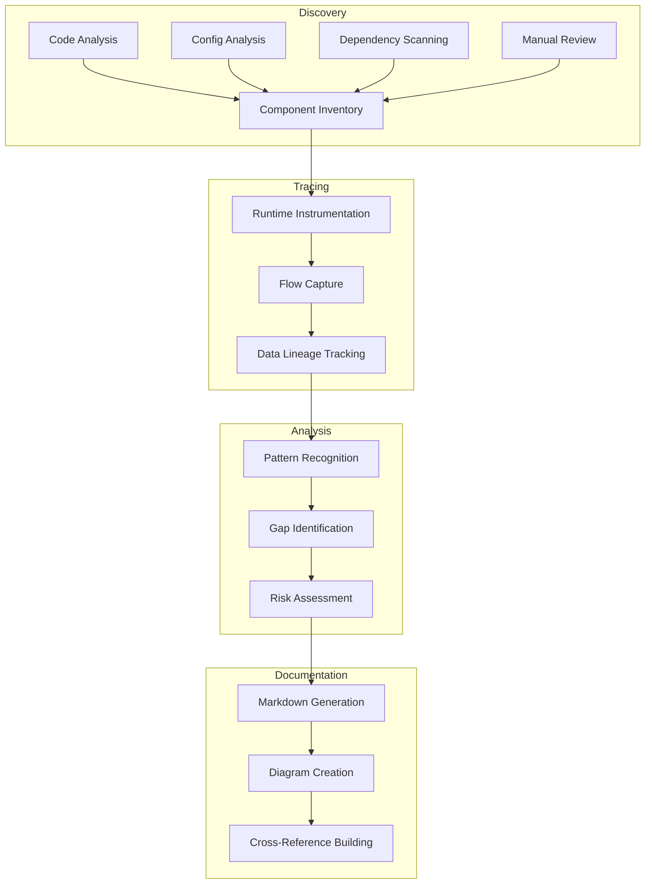

# Design Document: Platform Architecture Documentation

## Overview

This design describes a comprehensive architecture discovery system for the trading platform. The system will analyze, trace, and document the as-implemented architecture by examining code, configuration, runtime behavior, and data flows. The output will be structured markdown documentation with Mermaid diagrams that accurately represent the actual system behavior.

The architecture discovery process is analytical and observational - it documents what exists rather than proposing what should exist. This approach ensures that the documentation reflects reality, including legacy implementations, technical debt, and undocumented logic.

The discovery system will operate through a combination of:
- Static code analysis to identify components, dependencies, and data structures
- Runtime tracing to capture actual data flows and transformations
- Configuration analysis to understand deployment and integration patterns
- Manual code review to identify implicit logic and business rules

## Architecture

### High-Level Structure

The architecture discovery system consists of four major phases:

1. **Discovery Phase**: Automated and manual analysis to identify components, flows, and dependencies
2. **Tracing Phase**: Runtime observation to capture actual behavior and data transformations
3. **Analysis Phase**: Synthesis of discovered information to identify patterns, gaps, and risks
4. **Documentation Phase**: Generation of structured markdown with Mermaid diagrams



### Layered Approach

The discovery system will analyze the trading platform layer by layer:

1. **Ingestion Layer**: Webhook receivers, event parsers, initial validation
2. **Processing Layer**: Signal normalization, enrichment, routing
3. **Decision Layer**: Engine A, Engine B, sub-agents, business rules
4. **Execution Layer**: Order formatting, broker integration, submission
5. **Trade Management Layer**: Position tracking, P&L calculation, state management
6. **UI Layer**: Frontend components, data presentation, user interactions
7. **Infrastructure Layer**: Databases, message queues, caches, monitoring

## Components and Interfaces

### Component Discovery Engine

**Purpose**: Identify all services, modules, and infrastructure components

**Inputs**:
- Source code repositories
- Configuration files (docker-compose, kubernetes manifests, environment configs)
- Deployment scripts
- Infrastructure-as-code definitions

**Outputs**:
- Component inventory with metadata (name, type, technology, location)
- Dependency graph
- Communication pattern map

**Key Operations**:
- Scan source directories for service definitions
- Parse configuration files for deployment topology
- Analyze import/require statements for module dependencies
- Identify database connections, message queue subscriptions, and API endpoints

### Business Rule Extractor

**Purpose**: Catalog all agents, sub-agents, and business rules

**Inputs**:
- Decision engine source code
- Configuration files defining rules and triggers
- Agent registration and initialization code

**Outputs**:
- Agent catalog with purpose, inputs, outputs, triggers
- Business rule documentation with conditions and actions
- Decision flow diagrams

**Key Operations**:
- Identify agent class definitions and instantiations
- Extract rule conditions from code (if/when statements, pattern matching)
- Document trigger mechanisms (event subscriptions, scheduled tasks)
- Trace decision logic flow through agent interactions

### Flow Tracer

**Purpose**: Capture end-to-end data flows from webhook to UI

**Inputs**:
- Runtime logs with correlation IDs
- Instrumentation data from key components
- Database query logs
- Message queue traces

**Outputs**:
- End-to-end flow diagrams
- Data transformation documentation
- Timing and latency measurements

**Key Operations**:
- Inject correlation IDs at webhook ingestion
- Trace correlation IDs through all components
- Capture data snapshots at transformation boundaries
- Generate sequence diagrams from trace data

### Schema Analyzer

**Purpose**: Document all data contracts and transformations

**Inputs**:
- Type definitions (TypeScript interfaces, Python dataclasses, JSON schemas)
- Database schemas
- API specifications
- Message format definitions

**Outputs**:
- Complete schema documentation for all data structures
- Transformation mapping between schemas
- Validation rule documentation

**Key Operations**:
- Parse type definitions from source code
- Extract database schemas from migrations or ORM definitions
- Document field-by-field transformations between schemas
- Identify validation logic (required fields, type checks, business constraints)

### Boundary Analyzer

**Purpose**: Identify service responsibilities, overlaps, and violations

**Inputs**:
- Component inventory
- Code ownership and module structure
- Actual behavior from flow traces

**Outputs**:
- Service responsibility matrix
- Overlap and violation reports
- Boundary violation examples

**Key Operations**:
- Define expected responsibilities based on component names and documentation
- Compare expected vs actual behavior from traces
- Identify code that crosses service boundaries
- Flag duplicate logic across components

### State Machine Documenter

**Purpose**: Document order and position lifecycle state machines

**Inputs**:
- Order management code
- Position management code
- State transition logic
- Database state columns

**Outputs**:
- State machine diagrams
- Transition documentation with triggers and side effects
- Error state and recovery documentation

**Key Operations**:
- Identify all possible states from code and database schemas
- Extract transition logic from state management code
- Document triggering events for each transition
- Capture side effects (notifications, calculations, external calls)

### UI Flow Analyzer

**Purpose**: Document UI data flows and P&L calculation

**Inputs**:
- Frontend source code
- API endpoint definitions
- WebSocket/polling mechanisms
- P&L calculation code

**Outputs**:
- UI component data source documentation
- P&L calculation formula and logic
- Data refresh mechanism documentation

**Key Operations**:
- Trace data fetching in UI components
- Document API calls and data transformations
- Locate P&L calculation code
- Extract calculation formulas and data dependencies

### Dependency Mapper

**Purpose**: Catalog external dependencies and failure handling

**Inputs**:
- External API integration code
- Configuration for third-party services
- Error handling and retry logic
- Fallback mechanisms

**Outputs**:
- External dependency catalog
- Failure mode documentation
- Impact analysis for each dependency

**Key Operations**:
- Identify all external service integrations
- Document integration methods and data formats
- Extract error handling and retry logic
- Analyze impact of dependency failures on platform capabilities

### Failure Mode Analyzer

**Purpose**: Document failure scenarios and error handling at each layer

**Inputs**:
- Error handling code (try/catch, error returns)
- Retry logic
- Circuit breaker implementations
- Dead letter queues and error logs

**Outputs**:
- Failure mode catalog by layer
- Error handling flow diagrams
- Retry and fallback documentation

**Key Operations**:
- Identify error handling patterns in code
- Document retry strategies (exponential backoff, max attempts)
- Trace error propagation through layers
- Document fallback behaviors and degraded modes

### Gap and Risk Identifier

**Purpose**: Identify undocumented logic, coupling, race conditions, and ambiguities

**Inputs**:
- All discovered information from other components
- Code complexity metrics
- Concurrency patterns
- Ownership documentation

**Outputs**:
- Gap report (undocumented logic, missing error handling)
- Risk report (tight coupling, race conditions, ambiguous ownership)
- Duplication report

**Key Operations**:
- Compare documented vs actual behavior
- Identify shared mutable state and concurrent access patterns
- Detect duplicate logic across components
- Flag areas with unclear ownership

### Data Source Cataloger

**Purpose**: Document all integrated data sources with comprehensive details

**Inputs**:
- External API integration code
- Data provider configuration
- Data validation logic
- Criticality annotations or usage patterns

**Outputs**:
- Data source catalog with provider, type, frequency, access method
- Purpose and usage documentation
- Freshness requirements
- Validation logic
- Criticality classification
- Dependency diagrams

**Key Operations**:
- Identify all data source integrations
- Extract update frequency and access patterns
- Document how each data source is used
- Classify criticality based on impact analysis
- Create dependency graphs showing which flows require which data sources

### Documentation Generator

**Purpose**: Produce structured markdown documentation with Mermaid diagrams

**Inputs**:
- All outputs from discovery, tracing, and analysis components

**Outputs**:
- Markdown documentation organized by section
- Mermaid diagrams (component, sequence, state, data lineage, dependency graphs)
- Cross-references and navigation

**Key Operations**:
- Generate markdown sections from structured data
- Create Mermaid diagrams from graph and flow data
- Build cross-reference links between sections
- Organize content with clear hierarchy and navigation

## Data Models

### Component

```
Component {
  id: string
  name: string
  type: enum (service, module, infrastructure)
  technology: string
  location: string (repository path or deployment location)
  purpose: string
  dependencies: Component[]
  communicationPatterns: CommunicationPattern[]
}
```

### CommunicationPattern

```
CommunicationPattern {
  from: Component
  to: Component
  method: enum (http, grpc, message_queue, database, websocket)
  protocol: string
  dataFormat: string
}
```

### Agent

```
Agent {
  id: string
  name: string
  engine: enum (engine_a, engine_b)
  purpose: string
  inputs: DataContract[]
  outputs: DataContract[]
  triggers: Trigger[]
  businessRules: BusinessRule[]
}
```

### BusinessRule

```
BusinessRule {
  id: string
  name: string
  type: enum (entry, exit, position_sizing, risk_management)
  conditions: Condition[]
  actions: Action[]
  codeLocation: string
}
```

### Condition

```
Condition {
  field: string
  operator: enum (equals, greater_than, less_than, contains, matches)
  value: any
  logicalOperator: enum (and, or, not)
}
```

### Action

```
Action {
  type: enum (create_order, close_position, adjust_size, send_notification)
  parameters: map<string, any>
}
```

### Trigger

```
Trigger {
  id: string
  type: enum (event, schedule, condition)
  eventType: string (if type is event)
  schedule: string (if type is schedule, cron format)
  condition: Condition (if type is condition)
}
```

### Flow

```
Flow {
  id: string
  name: string
  startEvent: string
  endEvent: string
  steps: FlowStep[]
  dataTransformations: Transformation[]
}
```

### FlowStep

```
FlowStep {
  sequence: number
  component: Component
  operation: string
  input: DataContract
  output: DataContract
  errorHandling: ErrorHandler
  timing: TimingInfo
}
```

### Transformation

```
Transformation {
  fromSchema: DataContract
  toSchema: DataContract
  fieldMappings: FieldMapping[]
  computations: Computation[]
}
```

### FieldMapping

```
FieldMapping {
  sourceField: string
  targetField: string
  transformationType: enum (direct, computed, conditional)
}
```

### Computation

```
Computation {
  targetField: string
  formula: string
  dependencies: string[]
}
```

### DataContract

```
DataContract {
  name: string
  fields: Field[]
  validationRules: ValidationRule[]
  codeLocation: string
}
```

### Field

```
Field {
  name: string
  type: string
  required: boolean
  defaultValue: any
  description: string
}
```

### ValidationRule

```
ValidationRule {
  field: string
  rule: string
  errorMessage: string
}
```

### StateMachine

```
StateMachine {
  name: string
  entity: enum (order, position)
  states: State[]
  transitions: Transition[]
}
```

### State

```
State {
  name: string
  isInitial: boolean
  isFinal: boolean
  allowedTransitions: string[]
}
```

### Transition

```
Transition {
  fromState: string
  toState: string
  trigger: string
  conditions: Condition[]
  sideEffects: Action[]
}
```

### ExternalDependency

```
ExternalDependency {
  id: string
  name: string
  provider: string
  type: enum (webhook_source, broker, market_data, option_chain, other)
  integrationMethod: enum (rest_api, websocket, webhook, grpc)
  dataFormat: string
  usagePurpose: string
  failureHandling: FailureHandler
  dependentCapabilities: string[]
}
```

### FailureHandler

```
FailureHandler {
  detectionMechanism: string
  retryLogic: RetryStrategy
  fallbackBehavior: string
  alerting: string
}
```

### RetryStrategy

```
RetryStrategy {
  maxAttempts: number
  backoffType: enum (fixed, exponential, linear)
  initialDelay: number
  maxDelay: number
}
```

### FailureMode

```
FailureMode {
  id: string
  layer: enum (ingestion, processing, decision, execution, trade_management, ui, infrastructure)
  component: Component
  scenario: string
  detectionMechanism: string
  errorHandling: FailureHandler
  impact: string
}
```

### Gap

```
Gap {
  id: string
  type: enum (undocumented_logic, missing_error_handling, unclear_ownership, missing_validation)
  location: string
  description: string
  severity: enum (low, medium, high, critical)
}
```

### Risk

```
Risk {
  id: string
  type: enum (tight_coupling, race_condition, duplicate_logic, boundary_violation)
  location: string
  description: string
  impact: string
  likelihood: enum (low, medium, high)
}
```

### DataSource

```
DataSource {
  id: string
  name: string
  provider: string
  dataType: string
  updateFrequency: string
  accessMethod: enum (rest_api, websocket, file, database)
  purpose: string
  usageLocations: string[]
  freshnessRequirement: string
  validationLogic: ValidationRule[]
  criticality: enum (critical, important, optional)
  impactIfUnavailable: string[]
}
```

### DataLineage

```
DataLineage {
  dataElement: string
  source: DataSource
  transformations: Transformation[]
  destinations: Component[]
  flowPath: FlowStep[]
}
```

## Correctness Properties


*A property is a characteristic or behavior that should hold true across all valid executions of a system—essentially, a formal statement about what the system should do. Properties serve as the bridge between human-readable specifications and machine-verifiable correctness guarantees.*

### Property 1: Component Discovery Completeness

*For any* codebase with defined services, modules, and infrastructure components, the discovery system should identify and catalog all components that exist in the source code, configuration files, and deployment definitions.

**Validates: Requirements 1.1, 1.2, 1.3**

### Property 2: Dependency Identification Completeness

*For any* component in the system, all inter-component dependencies (imports, API calls, message subscriptions, database connections) should be identified and documented in the dependency graph.

**Validates: Requirements 1.5**

### Property 3: Entity Metadata Completeness

*For any* documented entity (component, agent, state transition, external dependency, failure mode, data source), all required metadata fields for that entity type should be populated in the documentation.

**Validates: Requirements 1.4, 2.2, 6.3, 8.2, 9.6, 11.2**

### Property 4: Agent and Rule Discovery Completeness

*For any* decision engine codebase, all sub-agent class definitions, business rule implementations, and trigger mechanisms should be identified and cataloged.

**Validates: Requirements 2.1, 2.3, 2.4**

### Property 5: Decision Logic Flow Accuracy

*For any* decision engine, the documented decision logic flow should match the actual code execution path when traced through agent interactions.

**Validates: Requirements 2.5**

### Property 6: End-to-End Flow Tracing Completeness

*For any* end-to-end flow (webhook to UI), all intermediate steps, components, data transformations, validation steps, and error handling should be captured and documented.

**Validates: Requirements 3.1, 3.2, 3.3, 3.4, 3.5, 3.6**

### Property 7: Schema Documentation Completeness

*For any* data contract type in the codebase (RawWebhookEvent, Normalized_Signal, Engine_Decision, Order_Request, Trade_Record, Position_Record, etc.), all fields, types, and validation rules should be extracted and documented.

**Validates: Requirements 4.1, 4.2, 4.3, 4.4, 4.5, 4.6**

### Property 8: Transformation Documentation Completeness

*For any* data transformation between schemas in the code, all field mappings and computation logic should be extracted and documented.

**Validates: Requirements 4.7**

### Property 9: Optional Field Condition Documentation

*For any* optional field in a data structure, the conditions under which that field is populated should be documented.

**Validates: Requirements 4.8**

### Property 10: Service Responsibility Documentation

*For any* service or layer in the system, the defined responsibilities should be documented based on component names, module structure, and intended design.

**Validates: Requirements 5.1**

### Property 11: Boundary Violation Detection

*For any* component that performs actions outside its defined service boundary, the violation should be identified and both the responsible component and the performing component should be documented.

**Validates: Requirements 5.2, 5.3, 5.5**

### Property 12: State Machine Documentation Completeness

*For any* entity with a state machine (orders, positions), all states, transitions, triggering events, validation logic, side effects, and error states should be extracted from the code and documented.

**Validates: Requirements 6.1, 6.2, 6.3, 6.5**

### Property 13: UI Component Data Tracing

*For any* UI component that displays trading data, the data source and all transformations from source to display should be traced and documented.

**Validates: Requirements 7.1, 7.2**

### Property 14: P&L Calculation Documentation

*For any* P&L calculation in the codebase, the location, formula, computation logic, and data dependencies should be extracted and documented.

**Validates: Requirements 7.3, 7.4**

### Property 15: UI Refresh Mechanism Identification

*For any* mechanism that updates UI data (polling, WebSocket, event subscription), the mechanism should be identified and documented.

**Validates: Requirements 7.5**

### Property 16: External Dependency Cataloging

*For any* external service integration in the codebase (TradingView, brokers, market data providers, option chain providers), the dependency should be cataloged with integration method, data format, usage purpose, failure handling, and dependent capabilities.

**Validates: Requirements 8.1, 8.2, 8.3, 8.4, 8.5**

### Property 17: Failure Mode Documentation by Layer

*For any* layer in the system (ingestion, processing, decision, execution, trade management), all failure modes with detection mechanisms, retry logic, and fallback behavior should be documented.

**Validates: Requirements 9.1, 9.2, 9.3, 9.4, 9.5, 9.6**

### Property 18: Gap and Risk Identification

*For any* codebase analyzed, all instances of implicit logic, tight coupling, race conditions, ambiguous ownership, and duplicated logic should be identified and documented without proposing solutions.

**Validates: Requirements 10.1, 10.2, 10.3, 10.4, 10.5, 10.6**

### Property 19: Data Source Cataloging Completeness

*For any* external data source integration (market data, option chains, broker feeds), the source should be cataloged with provider, data type, update frequency, access method, purpose, usage locations, freshness requirements, validation logic, and criticality classification.

**Validates: Requirements 11.1, 11.2, 11.3, 11.4, 11.5, 11.6, 11.7**

### Property 20: Mermaid Diagram Generation

*For any* documented entity that requires visualization (component relationships, flows, state machines, data lineage, data source dependencies), a valid Mermaid diagram with consistent notation should be generated.

**Validates: Requirements 3.7, 6.4, 9.7, 11.8, 12.2, 12.3, 12.4, 12.5, 12.6, 12.8**

### Property 21: Markdown Output Format

*For any* documentation generated, the output should be valid markdown with clear sections, proper organization, and navigation elements.

**Validates: Requirements 12.1, 12.7**

### Property 22: Actual Behavior Documentation

*For any* component or flow analyzed, the documentation should reflect actual implementation behavior from code analysis and runtime traces, including undocumented logic, without proposing improvements or omitting technical debt.

**Validates: Requirements 13.1, 13.3, 13.4, 13.5, 13.6**

### Property 23: No Improvement Proposals in Output

*For any* gap or risk documented, the description should not contain solution proposals, redesign suggestions, or improvement recommendations.

**Validates: Requirements 10.6, 13.4**

## Error Handling

### Discovery Phase Errors

**Missing Source Code**:
- Detection: File system checks before analysis
- Handling: Report missing repositories or directories, provide clear error messages
- Fallback: Continue with available sources, mark gaps in documentation

**Invalid Configuration Files**:
- Detection: Schema validation during config parsing
- Handling: Log validation errors with file location and issue description
- Fallback: Skip invalid configs, document as gaps

**Inaccessible Dependencies**:
- Detection: Import resolution failures
- Handling: Log unresolved dependencies
- Fallback: Document known dependencies, mark unresolved ones as gaps

### Tracing Phase Errors

**Missing Correlation IDs**:
- Detection: Check for correlation ID presence in logs
- Handling: Attempt to correlate by timestamp and component
- Fallback: Document partial flows, mark incomplete traces

**Incomplete Traces**:
- Detection: Flow steps that don't reach expected endpoints
- Handling: Document partial flows with clear indication of incompleteness
- Fallback: Supplement with static code analysis

**Runtime Instrumentation Failures**:
- Detection: Missing expected trace data
- Handling: Fall back to static analysis and log analysis
- Fallback: Document limitations in tracing coverage

### Analysis Phase Errors

**Ambiguous Patterns**:
- Detection: Multiple possible interpretations of code behavior
- Handling: Document all interpretations with confidence levels
- Fallback: Flag for manual review

**Conflicting Information**:
- Detection: Code analysis vs runtime traces showing different behavior
- Handling: Document both, flag discrepancy
- Fallback: Prioritize runtime behavior as actual behavior

### Documentation Phase Errors

**Invalid Mermaid Syntax**:
- Detection: Mermaid syntax validation
- Handling: Regenerate diagram with corrected syntax
- Fallback: Include textual description if diagram generation fails

**Circular References**:
- Detection: Dependency graph analysis
- Handling: Document circular dependencies explicitly
- Fallback: Break cycles for visualization, note actual circular structure

**Missing Required Data**:
- Detection: Template rendering checks for required fields
- Handling: Use placeholder values, mark as incomplete
- Fallback: Document gaps in discovery process

## Testing Strategy

The architecture discovery system will be validated through a dual testing approach combining unit tests for specific scenarios and property-based tests for universal correctness guarantees.

### Unit Testing

Unit tests will focus on:

1. **Specific Discovery Scenarios**: Test discovery of known components in sample codebases
2. **Edge Cases**: Empty repositories, single-file projects, complex dependency graphs
3. **Error Conditions**: Missing files, invalid configs, inaccessible dependencies
4. **Integration Points**: Component interactions, data flow between discovery phases
5. **Diagram Generation**: Valid Mermaid syntax for specific examples
6. **Scenario Validation**: The eight specific questions from Requirement 14

**Example Unit Tests**:
- Test discovery of a simple service with 3 modules
- Test handling of missing configuration file
- Test Mermaid diagram generation for a 3-node component graph
- Test answering "What happens to a webhook from TradingView?" for a known flow

### Property-Based Testing

Property-based tests will validate universal properties across many generated inputs. Each test will run a minimum of 100 iterations with randomized inputs.

**Property Test Library**: We will use **Hypothesis** (Python) or **fast-check** (TypeScript/JavaScript) depending on the implementation language.

**Property Test Configuration**:
- Minimum 100 iterations per test
- Each test tagged with: **Feature: platform-architecture-documentation, Property {number}: {property_text}**
- Randomized generation of codebases, configurations, and flows

**Example Property Tests**:

1. **Property 1 Test**: Generate random codebase structures, run discovery, verify all components are cataloged
   - Tag: **Feature: platform-architecture-documentation, Property 1: Component Discovery Completeness**

2. **Property 7 Test**: Generate random data contract definitions, run schema analyzer, verify all fields are documented
   - Tag: **Feature: platform-architecture-documentation, Property 7: Schema Documentation Completeness**

3. **Property 20 Test**: Generate random component graphs, run diagram generator, verify valid Mermaid syntax
   - Tag: **Feature: platform-architecture-documentation, Property 20: Mermaid Diagram Generation**

4. **Property 23 Test**: Generate random gap reports, verify no improvement proposals in output
   - Tag: **Feature: platform-architecture-documentation, Property 23: No Improvement Proposals in Output**

### Testing Balance

- Unit tests provide concrete validation of specific scenarios and edge cases
- Property tests provide comprehensive coverage across all possible inputs
- Together they ensure both correctness for known cases and robustness for unknown cases
- Focus property tests on universal invariants (completeness, consistency, format validity)
- Focus unit tests on specific examples, integration points, and the 8 scenario questions

### Validation Approach

The documentation output will be validated by:

1. **Automated Tests**: Unit and property tests as described above
2. **Scenario Questions**: Verify the documentation can answer all 8 questions from Requirement 14
3. **Manual Review**: Sample review of generated documentation for accuracy and completeness
4. **Comparison Testing**: Run discovery on known codebases and compare against manual documentation
